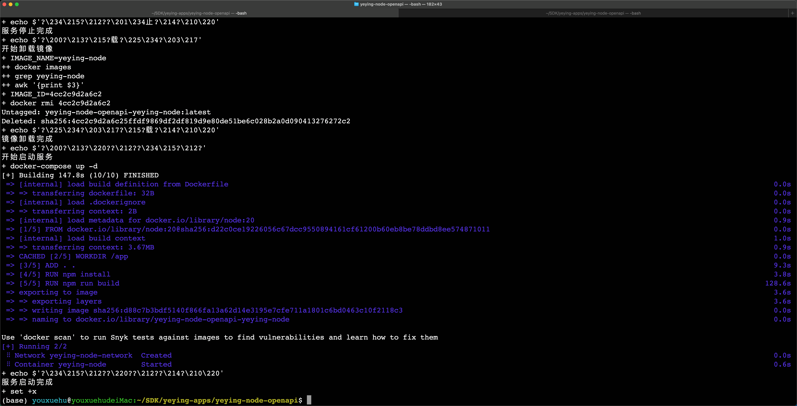
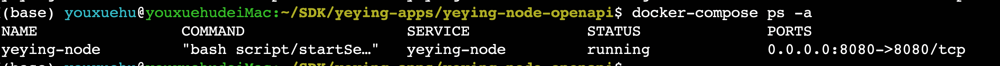

# yeying-community-node

YeYing 社区节点服务（Node.js）。提供 OpenAPI 接口与 SIWE/UCAN 鉴权，内置 Swagger UI 便于调试。文件存储通过前端使用 `@yeying-community/web3-bs` 的 WebDAV 接口直接访问。

## 主要功能
- OpenAPI 自动路由（`src/api` + `src/impl`）
- SIWE 登录 + UCAN 访问控制（Authorization: Bearer `<JWT|UCAN>`）
- WebDAV 存储（前端直连 WebDAV，使用 UCAN 作为 Bearer Token）
- Swagger UI（`/api-docs`，仅在 `APP_ENV=dev` 时启用）

## 设计文档
设计文档统一放在 `docs/` 目录下（Markdown + Mermaid），按语言分为：
- `docs/zh`（中文）
- `docs/en`（English）

## 开发与调试

### 环境准备
1. Node.js + npm
2. 配置环境变量
   ```bash
   cp .env.template .env
   ```
   常用变量：
   - `APP_ENV` / `APP_PORT`
   - `JWT_SECRET` / `ACCESS_TTL_MS` / `REFRESH_TTL_MS` / `AUTH_CHALLENGE_TTL_MS`
   - `COOKIE_SAMESITE` / `COOKIE_SECURE`
   - `UCAN_AUD` / `UCAN_RESOURCE` / `UCAN_ACTION`

### 启动开发服务
```bash
npm install
npm run dev
```
默认端口：`http://localhost:8001`

### Swagger UI
`http://localhost:8001/api-docs`（需 `APP_ENV=dev`）

### WebDAV 存储（前端）
当前服务端不再提供上传/下载接口。前端通过 `@yeying-community/web3-bs` 直接访问 WebDAV，并使用登录得到的 UCAN 作为 Bearer Token。

前端常用环境变量（由 Vite 读取）：
- `VITE_WEBDAV_BASE_URL`：WebDAV 基础地址
- `VITE_WEBDAV_PREFIX`：可选前缀路径
- `VITE_WEBDAV_PUBLIC_BASE`：可选公开访问前缀（未设置时回退为 `VITE_WEBDAV_BASE_URL + VITE_WEBDAV_PREFIX`）
- `VITE_WEBDAV_AVATAR`：默认头像路径（可选）

### 前端（可选）
```bash
cd web
npm install
npm run dev
```

---

# 镜像打包
```bash
docker build -t yeying-community-node:<tag> .
# 这里的tag需要与docker-compose.yml中的tag保持一致
```

# 本地部署
```bash
bash script/runner.sh -e dev
```

# 访问 api-docs
```
http://localhost:8001/api-docs/
```

# 测试环境部署： 走 docker-compose 部署
```bash
# 直接执行如下命令
cp .env.template .env
bash deploy.sh
```

# 如果遇到 data 目录无法访问
```bash
sudo chown -R 1001:1001 ./data
```

# 生产环境部署： 走 docker-compose 部署

## 修改启动参数
```bash
cp .env.template .env
# 修改 .env 文件， 一般修改如下2个参数
# APP_ENV 表示部署的环境，生产的改成 prod
```

## 执行启动命令
```bash
bash deploy.sh
```






