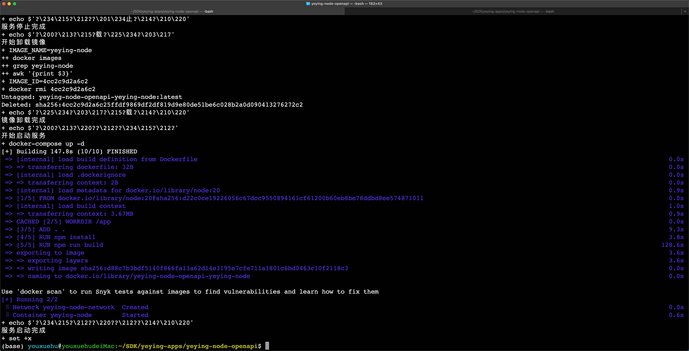
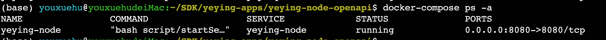
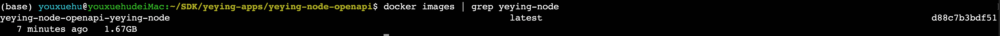

# node

YeYing 社区节点服务（Node.js）。提供 REST 接口与 SIWE/UCAN 鉴权。文件存储通过前端使用 `@yeying-community/web3-bs` 的 WebDAV 接口直接访问。

## 主要功能
- REST API（`src/routes` 按 public/admin/internal 分组）
- SIWE 登录 + UCAN 访问控制（Authorization: Bearer `<JWT|UCAN>`）
- UCAN 双模式：钱包校验模式 + 中心化签发模式（`/api/v1/public/auth/central/*`）
- WebDAV 存储（前端直连 WebDAV，使用 UCAN 作为 Bearer Token）

## 设计文档
设计文档统一放在 `docs/` 目录下（Markdown + Mermaid），当前仅保留中文版本。入口见 `docs/文档总览.md`。

## 快速启动（前后端）

建议使用两个终端分别启动后端与前端。
数据库支持 `PostgreSQL` / `MySQL`（不再支持 SQLite）。

### 1) 先拉起 PostgreSQL

中间件统一来自社区仓库：`git@github.com:yeying-community/deployer.git`

```bash
git clone git@github.com:yeying-community/deployer.git
cd deployer/middleware/postgresql
cp .env.template .env
docker compose up -d
```

首次可校验数据库是否可用：

```bash
cd deployer/middleware/postgresql
docker compose exec postgres sh -lc 'psql -U "$POSTGRES_USER" -d "$POSTGRES_DB" -c "select version();"'
```

如需创建业务库（例如 `node`）：

```bash
cd deployer/middleware/postgresql
./database.sh create-db -d node -u node_user
```

如需使用 MySQL（同样使用 deployer 仓库）：

```bash
cd deployer/middleware/mysql
cp .env.template .env
docker compose up -d
```

`config.js` 数据库配置与中间件映射：

```js
// PostgreSQL
database: {
  type: 'postgres',
  host: '127.0.0.1',
  port: 5432,
  database: 'node',
  username: 'node_user',
  password: '<your_password>',
  schema: 'node',
  synchronize: false
}

// MySQL
database: {
  type: 'mysql',
  host: '127.0.0.1',
  port: 3306,
  database: 'node',
  username: '<MYSQL_USER>',
  password: '<MYSQL_PASSWORD>',
  synchronize: true
}
```

后端（终端 1）：
```bash
cp config.js.template config.js
npm install
JWT_SECRET=$(openssl rand -hex 32) npm run dev
```
默认端口：`http://localhost:8100`
默认日志目录：`./logs`（按天轮转，保留 14 天）

说明：
- 模板默认不再写入明文 `auth.jwtSecret`，本地 `npm run dev` 请通过环境变量注入（如上）。
- 如果你使用加密密钥文件，推荐用 `npm run dev:secure`（会提示口令并在进程内解密）。

启动模式说明：
- 本地开发（推荐）：`npm run dev`
  - 读取 `config.js`
  - 支持热更新
  - 若配置了 `SECRETS_FILE`，会在进程内解密
- 生产/类生产：`bash scripts/starter.sh start|restart`
  - 读取构建产物 `dist/server.js`
  - 若存在 `SECRETS_FILE`（默认 `run/secrets.enc.json`），会在启动前提示输入密码，Node 进程内解密到内存
  - 不支持热更新

如果本地也要模拟“加密密钥启动”：
```bash
node scripts/init-secrets.cjs
SECRETS_FILE=run/secrets.enc.json bash scripts/starter.sh restart
```

本地开发也可以直接安全模式启动：
```bash
npm run dev:secure
# 或指定密钥文件
npm run dev:secure -- --file run/secrets.enc.json
```

常用配置项（`config.js`）：
- `app.env` / `app.port`
- `auth.jwtSecret` / `auth.accessTtlMs` / `auth.refreshTtlMs` / `auth.challengeTtlMs`
- `auth.cookieSameSite` / `auth.cookieSecure`
- `ucan.aud` / `ucan.with` / `ucan.can`
- `audit.approvers` / `audit.requiredApprovals`（上架审核人列表与通过阈值）

密钥收敛建议：
- `config.js` 中的 `auth.jwtSecret` / `ucanIssuer.privateKey` / `totpAuth.totpMasterKey` 建议保持空值。
- 使用 `run/secrets.enc.json` + 启动时输入密码，避免明文落盘与密钥环境变量注入。
- 若中心化签发或 TOTP 已启用但密钥未就绪，服务会在启动前直接失败。

前端（终端 2）：
```bash
cd web
cp .env.template .env
npm install
npm run dev
```
默认地址：`http://localhost:5173`

`web/.env` 里最关键的是：
- `VITE_NODE_API_ENDPOINT=http://localhost:8100`
- `VITE_WEBDAV_BASE_URL=<你的 WebDAV 地址>`

其余 UCAN 相关变量默认可不填：
- API 默认从 `VITE_NODE_API_ENDPOINT` 推导 audience，并使用 `app:all:<当前前端 host> + invoke`
- WebDAV 默认从 `VITE_WEBDAV_BASE_URL` 推导 audience，并使用 `app:all:<当前前端 host> + write`

### WebDAV 存储
当前服务端不再提供上传/下载接口。前端通过 `@yeying-community/web3-bs` 直接访问 WebDAV，并使用登录得到的 UCAN 作为 Bearer Token。

前端常用环境变量（由 Vite 读取）：
- `VITE_WEBDAV_BASE_URL`：WebDAV 基础地址
- `VITE_WEBDAV_PREFIX`：可选前缀路径
- `VITE_WEBDAV_PUBLIC_BASE`：可选公开访问前缀（未设置时回退为 `VITE_WEBDAV_BASE_URL + VITE_WEBDAV_PREFIX`）
- `VITE_WEBDAV_AVATAR`：默认头像路径（可选）

## 部署脚本

项目根目录提供两个部署相关脚本：

```bash
bash scripts/starter.sh
bash scripts/starter.sh stop
bash scripts/starter.sh restart

bash scripts/package.sh
bash scripts/package.sh v1.0.1
```

- `scripts/starter.sh` 支持 `start` / `stop` / `restart`，默认无参数等价于 `start`
- `scripts/package.sh` 输出到 `output/`，并按 `<project>-<tag>-<short-hash>.tar.gz` 命名
- 安装包内包含后端构建产物、`config.js.template`、`web/dist` 静态资源和 `scripts/starter.sh`
- 解压安装包后，进入目录执行 `bash scripts/starter.sh` 即可启动；若包内存在 `web/dist`，后端会自动托管前端静态资源
- 注意：`scripts/starter.sh` 面向生产/类生产启动；本地联调建议继续使用 `npm run dev`

### 生产密钥初始化（推荐）
为避免密钥明文写入 `config.js`，可使用内置脚本生成并加密保存：

```bash
node scripts/init-secrets.cjs
SECRETS_FILE=run/secrets.enc.json bash scripts/starter.sh restart
```

- `init-secrets.cjs` 会生成 `JWT_SECRET`、`UCAN_ISSUER_PRIVATE_KEY`、`UCAN_ISSUER_DID`、`TOTP_AUTH_TOTP_MASTER_KEY`
- 启动时会提示输入密码，Node 进程内解密密钥并仅驻留内存
- 详细说明见：`docs/加密启动.md`

### 查看 UCAN Issuer DID

有两种常用方式：

1. 从加密密钥文件读取

```bash
node scripts/unlock-secrets.cjs --file run/secrets.enc.json | grep '^UCAN_ISSUER_DID='
```

如果不指定 `--file`，默认读取 `run/secrets.enc.json`。

2. 从运行中服务读取当前生效值

```bash
curl http://127.0.0.1:8100/api/v1/public/auth/central/issuer
```

返回结果中的 `data.issuerDid` 就是当前服务实际使用的 DID。

建议：
- `ucanIssuer.did` 配置保持空值
- 统一以 `UCAN_ISSUER_PRIVATE_KEY` 为唯一密钥源
- DID 由私钥自动推导，避免手工填写不一致






