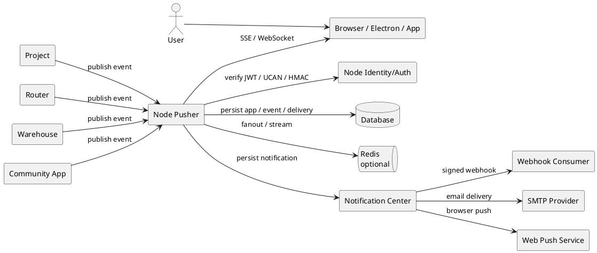
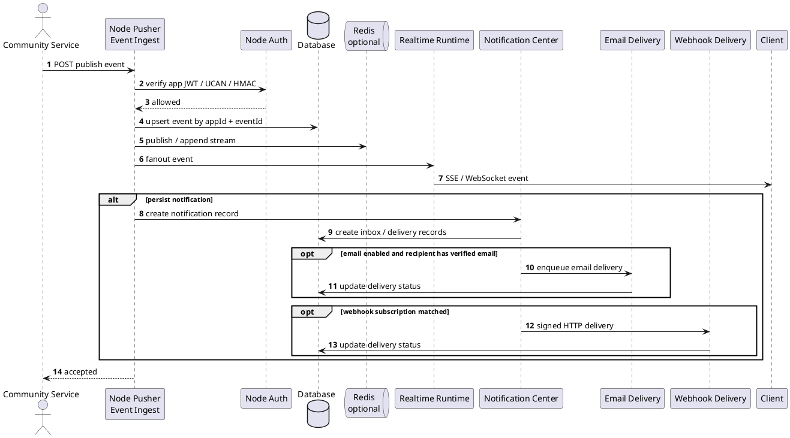

# Node Pusher 设计

本文档定义 Node 作为社区统一 Pusher 服务时的职责边界、协议选择、接口形态和迭代路线。目标是让 Project、Router、Warehouse 和后续社区项目不再各自重复建设实时推送、通知投递和事件订阅基础设施。

## 1. 目标定位

Node Pusher 是 Node 枢纽平台中的实时事件分发能力。它面向社区项目提供统一的 publish / subscribe / delivery 控制面：

- 社区项目向 Node 发布事件。
- Node 按 app、channel、recipient 和 event 规则鉴权。
- Node 将事件推送给在线客户端、服务端订阅方或通知中心。
- Node 统一记录投递、重试、审计和可观测状态。

一句话概括：

> Node Pusher 是社区项目共享的实时事件网关，不是第三方 Pusher SaaS 的简单代理。

## 2. 为什么需要 Node Pusher

Project 当前已经有 Swoole WebSocket、PushTask、友盟移动推送和本地离线消息缓存。Router、Warehouse 后续也会有状态同步、任务进度、授权结果、文件处理完成等推送需求。如果每个项目各自实现，会带来几个问题：

- 协议不统一，前端和应用重复接入。
- 鉴权、签名、channel 权限和审计分散。
- 多实例 fanout、断线续传、重试、死信队列重复建设。
- 移动端通知、浏览器通知、Webhook 和实时连接之间无法形成统一投递视图。
- 社区应用接入时需要分别理解 Project、Router、Warehouse 的内部推送实现。

Node 已经承担 Registry、Portal、Identity Provider、通知中心和 MPC 协调职责，适合作为社区级推送控制面。

## 3. 名词边界

### 3.1 Pusher SaaS

Pusher SaaS 是 Pusher 公司提供的云端实时通信服务。它常见产品包括 Pusher Channels 和 Pusher Beams。本文档中的 Node Pusher 不依赖 Pusher SaaS，也不要求购买或配置 Pusher 云服务。

### 3.2 Pusher Channels 兼容

Pusher Channels 是 Laravel 生态常用的实时广播协议。它不是 W3C 或 IETF 标准，但有公开协议文档，并被 Soketi、Laravel WebSockets 等开源项目实现为事实兼容协议。

Node Pusher 可以兼容 Pusher Channels 的关键子集，方便 Project 这类 Laravel 项目以较低成本接入。

### 3.3 WebSocket / SSE / Email / Web Push

- WebSocket：标准双向实时连接，适合浏览器或应用在线接收事件。
- SSE：标准单向事件流，适合状态推送、通知流、MPC 事件流和简单订阅。
- Email：标准异步通知出口，适合重要但不要求在线实时的消息，例如审批结果、安全告警、任务摘要。
- Web Push：浏览器后台系统通知标准，依赖 Service Worker、Push API、VAPID 和消息加密。

Node Pusher 不把这些投递通道混为一个协议。它在控制面统一事件模型，在投递面支持不同通道。

## 4. 设计原则

1. 标准优先：优先使用 WebSocket、SSE、HTTP、SMTP、Web Push、HMAC、JWT、UCAN 等可解释协议。
2. 兼容优先：对 Laravel / Project 提供 Pusher Channels 兼容子集，降低迁移成本。
3. Node 不接管业务状态：Project 的任务状态、Router 的路由状态、Warehouse 的文件状态仍由各自服务管理。
4. 事件不可替代业务查询：推送只负责提示变化，客户端最终状态仍应通过业务 API 查询确认。
5. 权限显式：app、channel、event、recipient 都必须有明确授权边界。
6. 至少一次投递：服务端到服务端投递默认 at-least-once，接收方必须按 event id 幂等。
7. 在线实时和离线通知分层：WebSocket/SSE 负责在线实时，通知中心/Webhook/Email/Web Push 负责离线或异步补偿。
8. 可渐进替换：Project 不需要一次性移除现有 Swoole PushTask，可以先把新增事件接入 Node Pusher。

## 5. 标准与兼容目标

### 5.1 一期必须遵守

| 范围 | 协议或标准 | 用途 |
| --- | --- | --- |
| HTTP API | HTTP/1.1 或 HTTP/2 + JSON | 服务端发布事件、管理 app、查询投递 |
| 服务端签名 | HMAC-SHA256 | app secret 签名 publish 请求 |
| 实时订阅 | SSE | 提供标准、易运维的单向事件流 |
| 事件格式 | CloudEvents 思路的轻量信封 | 统一事件 id、type、source、subject、time、data |
| 权限令牌 | JWT / UCAN | Node 内部用户、应用和资源能力鉴权 |
| Webhook 签名 | HMAC-SHA256 | 复用通知中心 webhook 投递安全模型 |
| Email 投递 | SMTP / Submission / MIME | 统一社区项目邮件通知出口 |

### 5.2 二期兼容

| 范围 | 协议或事实标准 | 用途 |
| --- | --- | --- |
| Pusher Channels HTTP API | `/apps/{app_id}/events`、`/batch_events` | 兼容 Laravel Pusher broadcaster |
| Pusher Channels Socket Protocol | protocol 7 子集 | 兼容 pusher-js / Laravel Echo |
| Private Channel Auth | `socket_id:channel_name` HMAC | 私有频道订阅授权 |
| Presence Channel | `presence-*` | 在线成员列表，二期后置 |

### 5.3 三期扩展

| 范围 | 标准 | 用途 |
| --- | --- | --- |
| Web Push | W3C Push API、Service Worker、RFC 8030、RFC 8291、RFC 8292 | 浏览器后台通知 |
| Email 可靠投递 | SMTP、DKIM、SPF、DMARC | 生产邮件送达、域名信誉和反伪造 |
| 多实例事件流 | Redis Pub/Sub / Redis Streams | fanout、断线续传、事件重放 |
| 死信队列 | 内部 delivery 状态机 | 长期失败投递追踪和人工重放 |

## 6. 总体架构



Node Pusher 内部建议拆成四层：

- App Registry：管理 pusher app、key、secret、origin、channel 规则。
- Event Ingest：接收发布事件，完成签名校验、限流、幂等和落库。
- Fanout Runtime：将事件投递到在线连接、Redis、SSE/WebSocket session。
- Delivery Bridge：把需要持久化或离线投递的事件转交通知中心、Webhook、Email、Web Push。

### 6.1 事件处理时序



## 7. 核心模型

### 7.1 Pusher App

```ts
type PusherApp = {
  uid: string
  appId: string
  key: string
  secretCiphertext: string
  owner: string
  allowedOrigins: string[]
  allowedChannels: string[]
  allowedEvents: string[]
  enabled: boolean
  createdAt: string
  updatedAt: string
}
```

字段说明：

- `appId`：服务端发布事件时使用的稳定标识，例如 `project`、`router`、`warehouse`。
- `key`：客户端连接时使用的公开 key，可以暴露给浏览器。
- `secretCiphertext`：服务端签名密钥，必须加密存储。
- `allowedOrigins`：允许建立浏览器连接的来源。
- `allowedChannels`：允许使用的频道模式，例如 `private-user.*`、`private-project.*`。
- `allowedEvents`：允许发布的事件模式，例如 `task.*`、`file.*`。

### 7.2 Channel

频道是事件 fanout 的路由键。

```text
public-{topic}
private-user.{walletAddressOrIdentityDid}
private-project.{instanceId}
private-app.{appId}
presence-project.{instanceId}
```

命名约束：

- 只允许字母、数字、点、下划线、连字符和冒号。
- `private-*` 必须经过订阅授权。
- `presence-*` 必须经过订阅授权，并携带 user info。
- 不允许服务端发布到未授权 channel pattern。

### 7.3 Event

Node Pusher 内部统一事件信封：

```ts
type PusherEvent = {
  id: string
  specversion: '1.0'
  type: string
  source: string
  subject: string
  appId: string
  channels: string[]
  socketId?: string
  time: string
  data: Record<string, unknown>
  persist?: boolean
  recipients?: string[]
  notification?: {
    title: string
    body?: string
    level?: 'info' | 'success' | 'warning' | 'error'
    channels?: Array<'inbox' | 'webhook' | 'email' | 'webpush'>
    templateId?: string
    locale?: string
  }
}
```

该结构借鉴 CloudEvents 的字段命名，但不要求一期完整实现 CloudEvents SDK。`id + appId` 必须幂等。

### 7.4 Delivery

```ts
type PusherDelivery = {
  uid: string
  eventId: string
  appId: string
  channel: string
  targetType: 'sse' | 'websocket' | 'webhook' | 'notification' | 'email' | 'webpush'
  target: string
  status: 'pending' | 'delivering' | 'delivered' | 'failed' | 'expired'
  attemptCount: number
  lastError: string
  createdAt: string
  updatedAt: string
}
```

一期在线 SSE/WebSocket delivery 可以只做内存计数；Webhook、notification、webpush 需要持久化。

## 8. API 设计

### 8.1 Node 原生 Publish API

```http
POST /api/v1/public/pusher/apps/:appId/events
Authorization: Bearer <app JWT or UCAN>
Content-Type: application/json
```

```json
{
  "id": "evt_01J...",
  "type": "task.updated",
  "source": "project",
  "subject": "task:123",
  "channels": ["private-project.project-main", "private-user.0x1111111111111111111111111111111111111111"],
  "data": {
    "taskId": 123,
    "status": "done"
  },
  "persist": true,
  "recipients": ["did:yeying:wid_xxx"],
  "notification": {
    "title": "任务已更新",
    "body": "任务 123 已完成",
    "level": "success"
  }
}
```

响应：

```json
{
  "eventId": "evt_01J...",
  "accepted": true,
  "channels": ["private-project.project-main", "private-user.0x1111111111111111111111111111111111111111"],
  "persisted": true
}
```

### 8.2 Node 原生 SSE 订阅

```http
GET /api/v1/public/pusher/apps/:appId/stream?channels=private-user.0x1111111111111111111111111111111111111111,private-project.project-main
Authorization: Bearer <user JWT or UCAN>
Accept: text/event-stream
```

事件帧：

```text
id: evt_01J...
event: task.updated
data: {"taskId":123,"status":"done"}
```

要求：

- 支持 `Last-Event-ID` 或 `cursor`。
- 服务端必须校验当前用户能否订阅请求的 private channel。
- 每 15 到 30 秒发送 heartbeat。
- 客户端断线后必须重连并携带 cursor。

### 8.3 Pusher-compatible Publish API

用于兼容 Laravel Pusher driver：

```http
POST /apps/:appId/events
```

请求体：

```json
{
  "name": "task.updated",
  "channels": ["private-project.project-main"],
  "data": "{\"taskId\":123}",
  "socket_id": "123.456"
}
```

签名参数按 Pusher Channels HTTP API 兼容子集处理：

```text
auth_key
auth_timestamp
auth_version
body_md5
auth_signature
```

一期只需要支持 server event publish，不支持 client event publish。

### 8.4 Pusher-compatible WebSocket

后续增加：

```text
GET /app/:key?protocol=7&client=js&version=...
```

连接建立后返回：

```json
{
  "event": "pusher:connection_established",
  "data": "{\"socket_id\":\"123.456\",\"activity_timeout\":30}"
}
```

订阅：

```json
{
  "event": "pusher:subscribe",
  "data": {
    "channel": "private-project.project-main",
    "auth": "app-key:signature"
  }
}
```

一期可先不实现 WebSocket，只提供 SSE 和 HTTP publish；Project 旧 WebSocket 仍可继续运行。

### 8.5 原生 HTTP + SSE 与 Pusher WebSocket 的区别

Node Pusher 会长期保留两套接入形态，但它们解决的问题不同。

#### 8.5.1 原生 HTTP publish + SSE subscribe

原生方案是 Node 自己定义的最小实时事件协议：

```text
服务端项目 -> HTTP publish -> Node Pusher -> SSE stream -> 前端
```

特点：

- 发布端使用标准 HTTP JSON，请求结构由 Node 控制。
- 订阅端使用 SSE，即浏览器原生 `EventSource` 或 fetch stream。
- 服务端到客户端是单向推送，客户端需要写操作时继续调用业务 HTTP API。
- 可以直接复用 Node 现有 JWT、UCAN、通知中心、Webhook、Redis Streams 和审计模型。
- 运维简单，Nginx、CDN、日志、限流和鉴权都按普通 HTTP 长连接处理。
- 断线续传天然适合用 `Last-Event-ID` 或 `cursor`。

适合一期：

- 通知红点、审批状态、授权结果、任务状态、文件处理进度。
- Project/Router/Warehouse 先增量接入，不替换现有 WebSocket。
- 需要统一事件模型、投递记录和 Email/Webhook/Web Push 桥接的场景。

限制：

- SSE 是单向的，不适合客户端直接向同一连接发送事件。
- 不能直接兼容 Laravel Echo / pusher-js。
- 浏览器对同一域名的 SSE 连接数量有上限，复杂多频道订阅要合并连接。
- 不提供 Pusher presence channel 的在线成员语义。

#### 8.5.2 Pusher-compatible WebSocket

Pusher-compatible 方案是为了兼容 Laravel / pusher-js / Laravel Echo 生态：

```text
Laravel broadcast -> Pusher-compatible HTTP API -> Node Pusher
前端 pusher-js -> Pusher-compatible WebSocket -> Node Pusher
```

特点：

- 接口、连接路径、事件名、channel auth 尽量兼容 Pusher Channels protocol。
- 前端可以使用 pusher-js 或 Laravel Echo。
- 支持双向 WebSocket 控制消息，例如 subscribe、unsubscribe、ping、pong。
- 后续可以支持 private channel、presence channel、client event。
- 对 Laravel 项目迁移友好，能把 `PUSHER_APP_*` 指向 Node。

适合二期：

- Project 想复用 Laravel Broadcasting。
- 已有前端或社区应用已经用 pusher-js / Laravel Echo。
- 需要 presence channel 在线成员列表。
- 需要尽量少改现有 Laravel broadcast 代码。

限制：

- 协议复杂度明显高于 SSE，需要实现 socket id、连接状态、channel auth、ping/pong、subscription ack、错误事件。
- 多实例部署必须处理连接路由和 fanout，一般需要 Redis Pub/Sub 或专门网关。
- Pusher Channels 是事实兼容协议，不是 W3C/IETF 标准，长期维护需要跟踪生态兼容差异。
- 完整兼容成本高，一期不应承诺完整 Pusher SaaS 功能。

#### 8.5.3 对比表

| 维度 | 原生 HTTP + SSE | Pusher-compatible WebSocket |
| --- | --- | --- |
| 目标 | Node 标准化最小协议 | 兼容 Laravel/Pusher 生态 |
| 发布时间 | 一期 | 二期 |
| 发布接口 | `/api/v1/public/pusher/apps/:appId/events` | `/apps/:appId/events` |
| 订阅接口 | `/api/v1/public/pusher/apps/:appId/stream` | `/app/:key?protocol=7...` |
| 客户端依赖 | 浏览器原生能力或轻量封装 | pusher-js / Laravel Echo |
| 通信方向 | 服务端到客户端单向实时 | WebSocket 双向控制，事件主要服务端到客户端 |
| 鉴权 | JWT / UCAN / app token | Pusher key/secret HMAC + channel auth |
| 断线续传 | `Last-Event-ID` / `cursor` 简单明确 | 需要自定义扩展或依赖事件保留层 |
| 私有频道 | Node 自定义 channel policy | Pusher private channel auth |
| Presence | 不作为一期目标 | 二期或三期可支持 |
| 运维复杂度 | 较低 | 较高 |
| 标准化程度 | HTTP + SSE 标准能力 | Pusher 事实兼容协议 |
| Project 迁移成本 | 需要写 publish client，前端接 SSE | Laravel Broadcasting 迁移成本更低 |
| 与通知中心集成 | 最直接 | 需要适配 Pusher 事件到 Node event |

推荐决策：

- 一期实现原生 HTTP publish + SSE subscribe，作为 Node 长期稳定协议。
- 一期同时预留 Pusher-compatible 数据模型和签名字段，避免后续重构。
- 二期实现 Pusher-compatible HTTP publish + private auth。
- Pusher-compatible WebSocket 放到二期后半或三期，确认 Project 确实需要 Laravel Echo / pusher-js 后再做。

### 8.6 Channel Auth

Node 原生授权：

```http
POST /api/v1/public/pusher/apps/:appId/channels/auth
Authorization: Bearer <user JWT or UCAN>
```

```json
{
  "socketId": "123.456",
  "channel": "private-project.project-main"
}
```

Pusher-compatible 授权响应：

```json
{
  "auth": "app-key:signature"
}
```

### 8.7 Project 身份映射

`private-project.<instanceId>` 订阅需要 Node 能判断当前登录主体是否属于 Project 实例。一期使用 Project 身份映射表，由管理端或同步脚本写入：

```http
GET /api/v1/admin/pusher/project-identities?instanceId=project-main
POST /api/v1/admin/pusher/project-identities
```

```json
{
  "instanceId": "project-main",
  "projectUserId": "1001",
  "identityDid": "did:yeying:wid_abc",
  "walletAddress": "0x1111111111111111111111111111111111111111",
  "metadata": {
    "nickname": "Alice"
  }
}
```

授权规则：

- `private-user.<subject>` 必须匹配当前登录主体。
- `private-project.<instanceId>` 必须存在 active Project 身份映射。
- 当前登录 token 仍主要携带钱包地址，因此一期同时支持用 `walletAddress` 匹配。
- 后续登录态稳定携带 Node DID 后，优先使用 `identityDid` 匹配。

权限来源：

- 用户 JWT 中的身份。
- UCAN capability。
- app 的 channel policy。
- 可选调用 Project/Router/Warehouse 的权限校验回调。

## 9. 鉴权与权限模型

### 9.1 App 发布鉴权

服务端发布事件支持两种方式：

1. Node 原生方式：使用 app JWT 或 UCAN。
2. Pusher 兼容方式：使用 app key + app secret HMAC。

Project 等社区项目优先使用原生方式；Laravel 广播兼容优先使用 Pusher 兼容方式。

### 9.2 Channel 订阅鉴权

订阅 private channel 必须满足：

- 当前用户已登录 Node，或提供可验证 UCAN。
- 请求 origin 在 app allowed origins 内。
- channel 匹配 app allowed channels。
- 用户对 channel 表达的资源有访问权。

资源权限可以通过三种策略实现：

- Node 本地策略：适合 `private-user.{id}`、`private-app.{appId}`。
- Node 本地映射：适合 Project 的 `private-project.{instanceId}`。
- UCAN capability：适合 Warehouse/Router 这类能力明确的服务。

### 9.3 Event 发布授权

发布事件必须满足：

- app enabled。
- event type 匹配 allowed events。
- channels 全部匹配 allowed channels。
- payload size 在限制内。
- event id 幂等。
- HMAC/JWT/UCAN 有效。

## 10. 与通知中心的关系

Node Pusher 负责实时事件入口和 fanout；通知中心负责可见通知、收件箱、Webhook 和投递追踪。

二者关系：

- Pusher event 默认不落入通知中心。
- 当 `persist=true` 或携带 `notification` 字段时，Node Pusher 创建通知中心记录。
- 通知中心继续负责 unread count、通知列表、Webhook delivery、重试和审计。
- 通知中心现有 SSE 可以保留，后续可统一迁移到 Pusher stream。

示例：

```text
Project task.updated
  -> Node Pusher fanout to private-project.project-main
  -> persist notification for assignees
  -> Notification Center inbox/webhook/email/webpush
```

### 10.1 Email 通知评估

Email 应该纳入 Node 的统一通知出口。理由是邮件通知和 Webhook 一样属于跨项目重复建设成本很高的能力：

- Project、Router、Warehouse 都会需要审批结果、安全告警、任务摘要、授权完成、文件处理完成等邮件通知。
- 每个项目单独维护 SMTP、模板、退订、限流、失败重试和投递日志，会造成配置分散和体验不一致。
- Node 已经负责身份、凭证、通知和审计，适合统一决定“谁可以收到什么类型的邮件”。

但 Email 不应该直接做在 Pusher realtime runtime 里。推荐边界是：

- Node Pusher 接收事件并判断是否需要持久化通知。
- 通知中心根据 `notification.channels`、用户偏好、应用策略和通知等级决定是否创建 email delivery。
- Email Delivery Worker 负责模板渲染、SMTP/API 投递、失败重试和状态记录。

### 10.2 Email 适用场景

适合邮件通知：

- 审批通过、驳回、撤销等低频关键结果。
- 登录、身份凭证、TOTP、Passkey、钱包关联等安全事件。
- 文件转码、索引、归档、导出等长任务完成。
- 每日/每周任务摘要、项目摘要、空间容量告警。
- 运维告警和服务降级通知。

不适合邮件通知：

- 高频聊天消息逐条通知。
- 鼠标位置、在线状态、输入中等实时协作状态。
- 秒级进度条更新。
- 可以通过在线 WebSocket/SSE 完成的短生命周期 UI 状态。

### 10.3 Email 标准与生产要求

一期可以先支持 SMTP Submission；生产环境必须把域名信誉和反伪造一起纳入设计：

- SMTP Submission：应用服务器向邮件服务提交邮件，通常使用 587 端口和 STARTTLS。
- MIME：邮件正文、HTML、多语言和附件格式。
- SPF：声明哪些服务器可以代表域名发信。
- DKIM：对邮件内容签名，证明邮件未被篡改且来自授权域。
- DMARC：定义 SPF/DKIM 校验失败时的收件方处理策略。

Node 配置不应让每个社区项目直接拿 SMTP 密码。推荐由 Node 统一持有邮件服务凭据，社区项目只发布事件和选择模板。

Node 当前已经有身份邮箱验证码发送能力，底层使用 `mail` 运行配置和 `MAIL_SMTP_USER` / `MAIL_SMTP_PASSWORD` 加密密钥。Node Pusher 的邮件能力不应新增另一套 SMTP 配置，而应把现有身份邮件发送器治理成通用 Mail Provider：

- Identity Email：继续用于邮箱验证码、凭证续签等身份场景。
- Notification Email：新增通用通知模板和投递记录。
- Shared Mail Provider：统一 SMTP/API provider、from、reply-to、退信地址、超时和发送限流。

建议运行配置扩展：

```ts
type MailRuntimeConfig = {
  host: string
  port: number
  secure: boolean
  from: string
  replyTo?: string
  bounceAddress?: string
  provider?: 'smtp' | 'ses' | 'sendgrid' | 'mailgun'
  timeoutMs?: number
  rateLimitPerMinute?: number
  maxAttempts?: number
  retryBaseDelayMs?: number
  retryMaxDelayMs?: number
}
```

其中 provider 一期只实现 `smtp`，其他 provider 只是为后续托管邮件服务预留抽象。

发件身份不是单个 `from` 字段，而是一组对用户、邮件服务商和收件方邮箱系统可见的身份配置：

- `From` 显示名和地址：用户在邮箱客户端看到的发件人，一期统一使用 `YeYing Notifications <no-reply@notify.yeying.com>`。
- `Reply-To`：用户点击回复时进入的地址，一期统一使用社区支持邮箱，项目级回复地址后置审核。
- `Return-Path` / bounce address：退信、投诉和投递失败回执进入的地址，通常由邮件服务商或专用子域管理。
- 发信域名或子域名：一期统一使用社区通知域名，例如 `notify.yeying.com`，需要配置 SPF、DKIM、DMARC。
- 品牌身份：邮箱客户端展示的组织名、头像、认证标识和反钓鱼信誉。
- 项目归属：所有社区项目共用 Node 统一发件身份，Project、Router、Warehouse 不分别持有 SMTP 密钥。

一期推荐使用 Node 统一社区发件身份，先把 SPF/DKIM/DMARC、退信处理、限流和品牌信誉集中治理。项目差异可以先体现在邮件主题、模板内容、`app.name` 和可选 `Reply-To`，不要让每个项目单独持有 SMTP 密钥或任意配置发件域名。

### 10.4 Email 模型扩展

通知中心可以增加邮件模板和用户偏好模型：

```ts
type EmailTemplate = {
  templateId: string
  name: string
  appId: string
  eventTypes: string[]
  subject: Record<string, string>
  htmlBody: Record<string, string>
  textBody: Record<string, string>
  variables: string[]
  category: 'security' | 'transactional' | 'digest' | 'marketing'
  enabled: boolean
}
```

```ts
type NotificationPreference = {
  subject: string
  appId: string
  eventType: string
  inboxEnabled: boolean
  emailEnabled: boolean
  webpushEnabled: boolean
  digestMode: 'instant' | 'daily' | 'weekly' | 'disabled'
}
```

偏好主体 `subject` 推荐使用 Node 统一身份主键，优先级为：

1. `did:yeying:wid_*`
2. 已验证钱包地址
3. 兼容旧项目的外部用户映射 ID

Email 地址来源必须是 Node 已验证邮箱凭证，或由接入项目通过可信用户映射提供并标记来源。安全类邮件应优先使用 Node 已验证邮箱。

```ts
type EmailDelivery = {
  uid: string
  notificationUid: string
  recipient: string
  email: string
  templateId: string
  status: 'pending' | 'delivering' | 'delivered' | 'failed' | 'suppressed'
  attemptCount: number
  providerMessageId: string
  lastError: string
  createdAt: string
  updatedAt: string
}
```

### 10.5 Email 模板变量

邮件模板变量必须显式声明，事件发布方不能直接提交任意 HTML。推荐变量分层：

```ts
type EmailTemplateContext = {
  event: {
    id: string
    type: string
    source: string
    subject: string
    time: string
  }
  app: {
    appId: string
    name: string
  }
  recipient: {
    subject: string
    displayName?: string
    email: string
    locale: string
  }
  data: Record<string, unknown>
  links: {
    primary?: string
    unsubscribe?: string
    preferences?: string
  }
}
```

模板渲染规则：

- HTML 模板必须经过变量转义，默认禁止原样插入 HTML。
- 链接必须经过 allowlist 校验，不能直接使用事件 payload 里的任意 URL。
- 邮件必须同时提供 text 和 html，text 用于可访问性和反垃圾评分。
- 模板更新应保留版本号，delivery 记录保存使用的模板版本。
- worker 发送时优先使用 `payload.emailTemplateId` 或 `payload.templateId` 指定的启用模板。
- 未指定模板时，按 `appId/source + eventType` 匹配启用模板；仍未匹配时使用 Node 内置默认模板。
- 一期模板变量使用 `{{path}}` 形式，例如 `{{notification.title}}`、`{{data.taskId}}`，HTML 输出默认转义。

### 10.6 Email 退订与偏好

邮件分四类处理：

| 类别 | 示例 | 是否允许关闭 | 默认策略 |
| --- | --- | --- | --- |
| `security` | 登录异常、TOTP 变更、钱包关联、凭证即将过期 | 不允许完全关闭，只允许限频 | 即时发送 |
| `transactional` | 审批结果、授权完成、文件导出完成 | 允许按 app / event 关闭 | 重要事件即时发送 |
| `digest` | 项目日报、任务周报、空间用量摘要 | 允许关闭或调整频率 | 一期默认关闭聚合发送，只预留模型 |
| `marketing` | 社区公告、活动通知 | 必须允许退订 | 默认关闭，除非用户订阅 |

退订要求：

- 每封非安全邮件必须包含偏好设置链接。
- marketing 类邮件必须包含一键退订能力。
- 退订只影响 email，不影响站内通知和安全审计。
- 安全类邮件不能被完全关闭，但必须支持频率限制和异常抑制。
- 通知偏好 API 必须拒绝把 `security.*` 或包含 `.security.` 的事件类型设置为 `emailEnabled=false`。

### 10.7 Email API 草案

管理邮件模板：

```http
GET /api/v1/admin/pusher/email/templates
POST /api/v1/admin/pusher/email/templates
PATCH /api/v1/admin/pusher/email/templates/:templateId
```

用户偏好：

```http
GET /api/v1/public/pusher/notification-preferences
PATCH /api/v1/public/pusher/notification-preferences
```

投递查询：

```http
GET /api/v1/admin/pusher/apps/:appId/email-deliveries
GET /api/v1/public/notifications/:uid/deliveries
```

### 10.8 Email 策略建议

- 默认只对 `warning` / `error` / 安全事件 / 明确配置的摘要事件发邮件。
- 默认不对高频业务事件发即时邮件。
- 同一用户、同一 app、同一事件类型应支持频率限制。
- 支持 digest，把多个低优先级事件合并为日报或周报。
- 用户必须可以关闭非安全类邮件。
- 安全类邮件可不允许关闭，但必须严格限流。
- 所有邮件 delivery 进入统一投递状态和审计视图。

### 10.9 Email 决策点

已确认的 Email 决策：

- Email 纳入一期，但定位为通知中心的离线/异步投递出口，不作为实时推送通道。
- 发件域名统一使用社区通知域名，例如 `notify.yeying.com`。
- 发件人显示统一使用 `YeYing Notifications <no-reply@notify.yeying.com>`。
- `Reply-To` 一期统一使用社区支持邮箱，项目级回复地址后置审核。
- 收件邮箱优先使用 Node 已验证邮箱；外部项目邮箱只作为可信映射后置支持。
- 安全类邮件不能完全退订，只允许限流、异常抑制或降低频率。
- `security` 默认即时发送；重要 `transactional` 事件即时发送；`digest` 一期默认关闭聚合发送，只预留模型。
- 模板由 Node 治理，应用引用已审核模板，不直接提交任意 HTML。
- 多语言模板可以纳入设计；一期至少提供 `zh-CN`，公共模板补齐 `en-US`。
- 一期只使用 SMTP provider，SES、SendGrid、Mailgun 等 API provider 后置。
- 一期提供统一邮件偏好和退订入口。

## 11. 与社区项目的接入方式

### 11.1 Project

Project 可分阶段接入：

1. 保留现有 Swoole WebSocket 和 PushTask。
2. 新增关键业务事件发布到 Node Pusher，例如 `task.updated`、`dialog.unread_changed`。
3. 新前端模块优先订阅 Node Pusher SSE。
4. 如果需要兼容 Laravel Broadcasting，再启用 Pusher-compatible API。
5. 最后再评估是否迁移旧 PushTask。

Project `.env` 可逐步从无效 Pusher 预留项升级为 Node Pusher 配置：

```env
BROADCAST_DRIVER=pusher
PUSHER_APP_ID=project
PUSHER_APP_KEY=<node-issued-key>
PUSHER_APP_SECRET=<node-issued-secret>
PUSHER_APP_CLUSTER=mt1
PUSHER_HOST=node.example.com
PUSHER_PORT=443
PUSHER_SCHEME=https
```

### 11.2 Router

Router 适合优先使用 Node 原生 API：

- 授权请求状态变化。
- 钱包身份登录结果。
- 路由实例健康状态。
- 用户待确认操作。
- 安全类邮件通知，例如授权异常、凭证即将过期、敏感操作确认。

Router 可使用 DID/JWT/UCAN 作为订阅权限依据。

### 11.3 Warehouse

Warehouse 适合发布：

- 文件上传完成。
- 分享链接创建或撤销。
- 后台索引完成。
- 配额告警。
- WebDAV 长任务状态。
- 文件处理失败、容量不足、公开分享异常等邮件通知。

Warehouse 推荐使用 UCAN capability 限定 channel 和事件发布范围。

### 11.4 社区应用

社区应用可以使用两种方式：

- 服务端发布事件到 Node Pusher。
- 前端通过 Node Pusher 订阅自己有权限的 channel。

应用发布协议后续可增加：

```json
{
  "realtime": {
    "channels": ["private-app.ai", "private-user.*"],
    "events": ["agent.run.started", "agent.run.completed"]
  }
}
```

## 12. 数据结构草案

### 12.1 `pusher_apps`

```ts
type PusherAppDO = {
  uid: string
  appId: string
  key: string
  secretCiphertext: string
  owner: string
  allowedOrigins: string
  allowedChannels: string
  allowedEvents: string
  enabled: boolean
  createdAt: string
  updatedAt: string
}
```

索引：

- `app_id` unique
- `key` unique
- `(owner, app_id)`

### 12.2 `pusher_events`

```ts
type PusherEventDO = {
  uid: string
  appId: string
  eventId: string
  eventType: string
  source: string
  subject: string
  channelsJson: string
  dataJson: string
  socketId: string
  persistedNotificationUid: string
  createdAt: string
  expiresAt: string
}
```

索引：

- `(app_id, event_id)` unique
- `(app_id, created_at)`
- `(app_id, event_type)`

### 12.3 `pusher_channel_auth_logs`

```ts
type PusherChannelAuthLogDO = {
  uid: string
  appId: string
  channel: string
  subject: string
  origin: string
  allowed: boolean
  reason: string
  createdAt: string
}
```

### 12.4 `pusher_connections`

连接表可以二期再持久化。一期可只在内存或 Redis 中维护：

```ts
type PusherConnection = {
  socketId: string
  appId: string
  subject: string
  origin: string
  channels: string[]
  connectedAt: string
  lastSeenAt: string
}
```

## 13. 事件命名规范

事件名使用反向领域层次：

```text
task.created
task.updated
task.deleted
task.reminded
dialog.message.created
dialog.unread.changed
file.upload.completed
file.preview.completed
warehouse.share.created
router.auth.approved
application.installed
agent.run.completed
```

约束：

- 小写字母、数字、点和下划线。
- 不在事件名中放用户 id、项目 id 等实例标识。
- 实例标识放在 `subject`、`channels` 或 `data` 中。
- 破坏性变化必须升级事件名或增加 `data.version`。

## 14. 安全要求

### 14.1 Secret 管理

- app secret 必须加密存储。
- secret 不返回明文，只允许创建时展示一次或通过轮换生成。
- 支持 key rotation：active key 和 previous key 在短窗口内共存。

### 14.2 Origin 校验

浏览器订阅必须校验 `Origin`：

- allowed origins 为空时默认拒绝浏览器连接。
- 本地开发可显式配置 `http://localhost:*` 或具体端口。
- 不允许用 `*` 开放 private/presence channel。

### 14.3 Payload 限制

建议默认限制：

- 单事件 payload 不超过 32KB。
- 单请求 channels 不超过 100 个。
- 单 app 每秒 publish 速率可配置。
- 单连接订阅 channel 数可配置。

### 14.4 幂等与重放

- publish 请求必须有 event id；兼容 Pusher API 无 id 时由 Node 生成。
- 原生 API 的 `appId + eventId` 必须幂等。
- HMAC 请求使用 timestamp，默认 5 分钟有效。
- Webhook 接收方按 delivery id 或 event id 幂等处理。

## 15. 可观测性

Node Pusher 应提供最少这些指标：

- active connections
- subscribed channels
- publish rate
- fanout count
- publish reject count
- auth reject count
- webhook delivery success/failure
- Redis pubsub/stream lag
- reconnect count

管理 API 可后续提供：

```http
GET /api/v1/admin/pusher/apps
GET /api/v1/admin/pusher/apps/:appId/events
GET /api/v1/admin/pusher/apps/:appId/connections
GET /api/v1/admin/pusher/apps/:appId/deliveries
```

## 16. 迭代路线

### 阶段一：Node 原生 Pusher MVP

- `pusher_apps` 管理和密钥加密。
- 原生 publish API。
- 原生 SSE stream。
- channel pattern 校验。
- JWT/UCAN 订阅鉴权。
- Redis Pub/Sub 多实例实时 fanout。
- 数据库 `pusher_events` cursor 回放。
- 可选转通知中心。
- SMTP provider 复用和治理。
- Email template 管理。
- Email delivery worker、重试、限流和审计。
- 安全类邮件、事务类邮件、摘要类邮件的默认策略。
- Project 新增一个业务事件试点。

### 阶段二：Pusher Channels 兼容子集

- `/apps/:appId/events`。
- Pusher HMAC 签名校验。
- `/apps/:appId/batch_events`。
- private channel auth 接口契约。
- Laravel Broadcasting 后端发布最小联调。

### 阶段三：WebSocket Gateway

- `/app/:key?protocol=7`。
- `pusher:connection_established`。
- subscribe / unsubscribe。
- ping / pong。
- private channel fanout。
- pusher-js / Laravel Echo 前端订阅最小联调。

### 阶段四：Presence 与事件保留

- presence channel。
- join / leave / member list。
- Redis Streams 事件保留。
- `Last-Event-ID` / cursor 续传。
- 管理端连接和 channel 可观测。

### 阶段五：Web Push 与多出口增强

- 用户通知偏好和 digest 增强。
- Email bounce / complaint 事件接收和抑制列表。
- 邮件服务商 API provider，例如 SES、SendGrid、Mailgun。
- Web Push subscription 管理。
- VAPID 配置。
- Service Worker 接入说明。
- 与通知中心 delivery 状态统一。
- 死信队列和人工 replay。

## 17. Project 迁移建议

Project 当前的 `PUSHER_APP_*` 配置如果没有启用 Laravel Broadcasting，可以先视为历史预留。迁移到 Node Pusher 时建议：

1. 先不删除 Swoole PushTask。
2. 在 Node 创建 `project` pusher app，生成 key/secret。
3. Project 增加 Node Pusher publish client。
4. 选择一个低风险事件试点，例如任务状态变化。
5. 前端新增 Node SSE 订阅，不替换旧 WebSocket。
6. 稳定后再评估 Laravel Broadcasting / Pusher-compatible API。
7. 最后决定哪些旧 PushTask 可以逐步迁移或保留为项目内实时通道。

## 18. 已确认决策

| 决策项 | 结论 | 影响 |
| --- | --- | --- |
| Node Pusher 一期协议 | 原生 HTTP publish + SSE subscribe | 先建立 Node 长期稳定协议，快速复用现有 HTTP、鉴权、通知中心和审计能力 |
| Email 是否纳入一期 | 纳入 | 避免 Project、Router、Warehouse 各自建设 SMTP、模板、退订、限流和投递日志 |
| Email 定位 | 通知中心的离线/异步投递出口 | 不把 Email 混入实时连接 runtime，统一由通知中心和 delivery worker 调度 |
| 收件邮箱来源 | 优先 Node 已验证邮箱 | 安全类邮件使用可信邮箱，外部项目邮箱通过可信映射后置支持 |
| 安全类邮件退订 | 不允许完全关闭，只允许限频或异常抑制 | 防止用户错过登录、TOTP、Passkey、钱包关联和凭证变更等安全事件 |
| Pusher-compatible 范围 | 先 HTTP publish + private auth，WebSocket 后置 | Laravel 后端可以先接入发布能力，前端继续优先用 SSE |
| Email 默认策略 | `security` 即时；重要 `transactional` 即时；`digest` 一期默认关闭聚合发送，只预留模型 | 控制打扰和成本，避免高频事件默认发邮件 |
| 模板治理 | Node 管理模板，应用引用已审核模板 | 降低钓鱼、HTML 注入、品牌混乱和多语言不一致风险 |
| 多语言模板 | 可以纳入设计 | 一期至少 `zh-CN`，公共模板补 `en-US` |
| 发件域名 | 统一社区发件域名，例如 `notify.yeying.com` | SPF/DKIM/DMARC、退信处理和品牌信誉集中治理 |
| 发件人显示 | `YeYing Notifications <no-reply@notify.yeying.com>` | 用户在邮箱客户端看到稳定可信的统一身份 |
| `Reply-To` | 一期统一支持邮箱，项目级回复地址后置审核 | 避免用户回复无人处理，同时不放开项目任意配置 |
| Project 身份映射 | Node DID 做主键，Project user id 做外部映射 | 决定 private channel 鉴权、收件人解析和审计归属 |
| Project 接入路径 | 先原生 publish client，后 Pusher-compatible | 不强迫立即迁移 Laravel Broadcasting 或 Swoole PushTask |
| Digest 策略 | 一期先不做聚合发送，只预留模型 | 降低一期 worker、模板和偏好复杂度 |
| 邮件偏好入口 | 用户设置页提供统一邮件偏好和退订管理 | 提供用户可控性和合规入口 |

## 19. 仍需决策的事项

P0/P1 已按推荐方案确认。下面事项可以后置到实现推进或规模明确后再确认。

| 优先级 | 决策项 | 推荐默认 | 影响 |
| --- | --- | --- | --- |
| P2 | bounce / complaint 处理 | 一期先记录 SMTP 投递失败，邮件服务商 API 接入后再处理退信 webhook | 影响抑制列表、退信追踪和邮箱信誉保护 |
| P2 | Presence channel | 有明确在线成员场景后再实现 | 避免先做高复杂度状态同步 |
| P2 | Web Push | Email 稳定后再做 | 需要 Service Worker、VAPID、浏览器权限和订阅生命周期 |
| P2 | 邮件服务商 API | SMTP 先行，SES/SendGrid/Mailgun 后续 provider | 影响投递可观测性、退信处理和成本 |
| P2 | Delivery 保留期 | 默认 90 天，安全审计可更长 | 影响数据库体量和审计能力 |
| P2 | 跨地域部署 | 单地域先行，跨地域等连接规模明确后设计 | 影响 Redis、连接路由、事件顺序和故障切换 |

## 20. 开放问题

- Router、Warehouse 是否都需要 private channel，还是部分事件只需要 webhook？
- 是否允许社区应用直接发布事件，还是必须通过 Project/Router/Warehouse 后端代理。
- presence channel 是否有明确业务场景，例如在线协作、在线成员列表。

## 21. 参考

- WebSocket：RFC 6455，https://www.rfc-editor.org/rfc/rfc6455
- Server-Sent Events：HTML Living Standard，https://html.spec.whatwg.org/multipage/server-sent-events.html
- Pusher Channels Protocol：Pusher socket protocol v7，https://github.com/pusher/pusher-socket-protocol/blob/master/protocol.adoc
- Pusher Channels HTTP API：server event publish API，https://pusher.com/docs/channels/server_api/http-api/
- Laravel Broadcasting：Pusher driver 集成形态，https://laravel.com/docs/broadcasting
- CloudEvents 1.0：事件信封字段设计参考，https://github.com/cloudevents/spec
- SMTP：RFC 5321，https://www.rfc-editor.org/rfc/rfc5321
- Message Submission：RFC 6409，https://www.rfc-editor.org/rfc/rfc6409
- MIME：RFC 2045，https://www.rfc-editor.org/rfc/rfc2045
- DKIM：RFC 6376，https://www.rfc-editor.org/rfc/rfc6376
- DMARC：RFC 7489，https://www.rfc-editor.org/rfc/rfc7489
- Web Push：RFC 8030，https://www.rfc-editor.org/rfc/rfc8030
- Web Push Encryption：RFC 8291，https://www.rfc-editor.org/rfc/rfc8291
- VAPID：RFC 8292，https://www.rfc-editor.org/rfc/rfc8292
