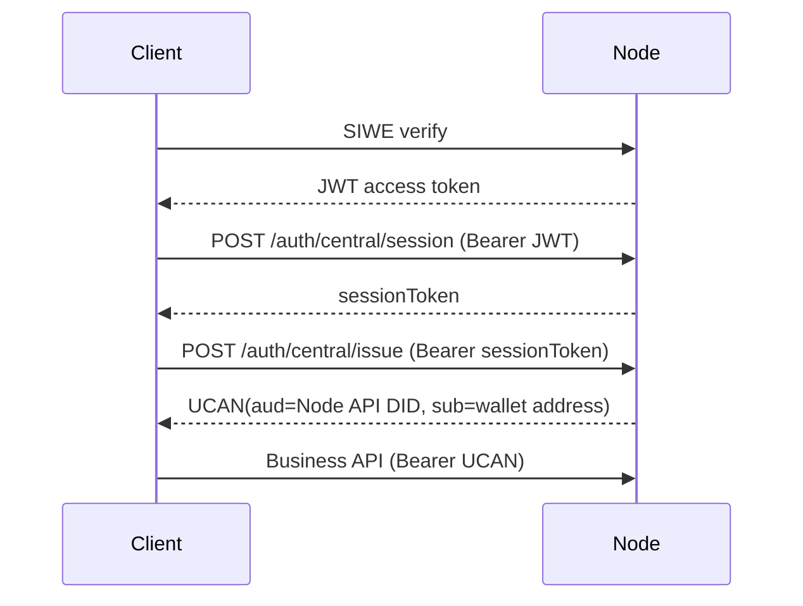
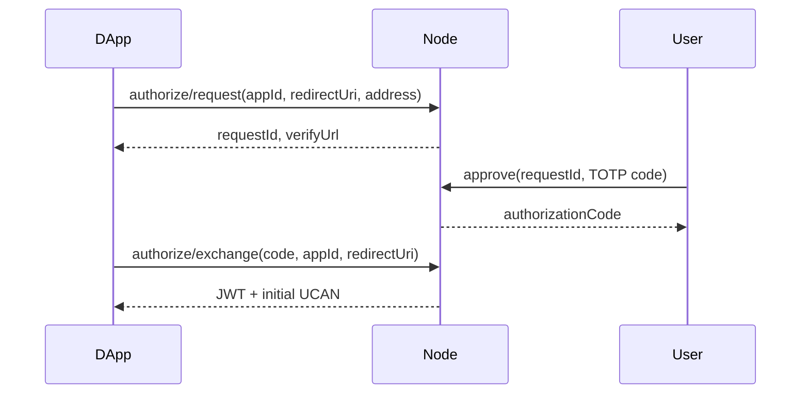

# Node UCAN 权限设计规划

本文基于 wallet 项目的 `/Users/liuxin2/Workspace/opensource/wallet/docs/UCAN协议说明.md`，规划 Node 服务侧的 UCAN 权限模型、接口能力矩阵、校验架构和落地步骤。

## 1. 设计目标

Node 侧 UCAN 权限设计要解决四个问题：

- 让 Node 能严格验证“这张 UCAN 是否发给我”：即 `aud` 必须绑定 Node API 服务身份。
- 让 Node 能按接口验证“这次请求要做什么”：即 `cap[].with/can` 必须匹配路由要求。
- 让 DApp 权限和业务资源边界可审计：能力表达必须稳定、可读、可展示。
- 兼容钱包签发和中心化签发两种模式：钱包模式验证 proof chain，中心化模式验证可信 issuer。

不把 UCAN 设计成替代所有业务权限的万能机制。UCAN 负责“请求令牌的能力边界”，Node 现有用户状态、角色、管理员、申请人/审批人等业务权限仍然保留。

## 2. 协议原则

沿用 wallet 文档中的三层模型：

1. 钱包连接：证明站点可以请求钱包能力，不等于拥有业务权限。
2. Root UCAN：会话级授权上限，面向 DApp 自身 DID。
3. Invocation UCAN：请求级令牌，面向具体服务 DID，也就是 Node 的 `UCAN_AUD`。

Node 只接受 Invocation UCAN：

- `aud` 必须等于 Node 配置的服务 DID，例如 `did:web:node.example.com`。
- `cap` 必须包含当前接口需要的最小能力。
- `exp/nbf` 必须有效。
- 钱包模式下，Invocation 的 proof chain 必须能回到 Root UCAN，且下游能力不能超过上游。
- 中心化模式下，`iss` 必须等于配置的 `UCAN_ISSUER_DID`，`sub` 才是最终用户主体。

## 3. Node 作为中心化 UCAN Issuer

Node 在本系统里不只是一个验证 UCAN 的资源服务，也承担中心化 UCAN Issuer 的职责。这个角色要明确描述，否则容易把“谁签发授权”“谁消费授权”“谁代表用户”混在一起。

### 3.1 角色定位

Node 作为中心化 Issuer 时，承担的是“受信任授权签发服务”：

- 它用服务端 Ed25519 私钥签发 UCAN。
- 它把已完成登录、TOTP 授权或应用授权的用户映射成 UCAN `sub`。
- 它根据服务端策略决定 `audience/capabilities/ttl`，而不是完全相信客户端传参。
- 它签出的 UCAN 可以被 Node 自己验证，也可以被其它信任该 Issuer DID 的服务验证。

因此中心化 UCAN 的语义是：

```text
Node Issuer DID says:
  subject <sub> may use capabilities <cap>
  against audience <aud>
  before <exp>
```

它不同于钱包 proof-chain 模式：

- 钱包模式的 `iss` 是会话 DID，用户身份来自 Root SIWE proof。
- 中心化模式的 `iss` 是 Node Issuer DID，用户身份来自 `sub`。
- 中心化模式没有钱包 Root UCAN proof chain，信任根从“用户钱包签名”转为“Node 的认证和签发策略”。

### 3.2 Node 的两个 DID

Node 至少涉及两个不同身份，不能混用：

| 身份 | 配置 | 出现位置 | 语义 |
| --- | --- | --- | --- |
| Node API Audience DID | `ucan.aud` / `UCAN_AUD` | token `aud` | 这张 UCAN 是发给哪个资源服务消费的 |
| Node Issuer DID | `ucanIssuer.did` / `UCAN_ISSUER_DID` | token `iss` | 这张 UCAN 是由哪个中心化签发者签发的 |

如果 Node 给自己签发访问 Node API 的 UCAN，典型结构是：

```json
{
  "iss": "did:key:zNodeIssuer...",
  "aud": "did:web:node.example.com",
  "sub": "0x1234...",
  "cap": [
    { "with": "node:application:public", "can": "read" }
  ],
  "nbf": 1767140000,
  "exp": 1767140600
}
```

其中：

- `iss` 是签发者，不是最终用户。
- `aud` 是消费服务，不是资源范围。
- `sub` 才是最终用户主体。
- `cap` 是这个用户在该 audience 下被允许使用的能力。

如果 Node 给 Router 或 WebDAV 签发 UCAN，`aud` 应改为对应服务 DID：

```json
{
  "iss": "did:key:zNodeIssuer...",
  "aud": "did:web:router.example.com",
  "sub": "0x1234...",
  "cap": [
    { "with": "app:all:chat-example", "can": "invoke" }
  ],
  "nbf": 1767140000,
  "exp": 1767140600
}
```

这说明同一个 Node Issuer 可以给不同服务签发 token，但每张 Invocation UCAN 仍然只能绑定一个明确 `aud`。

### 3.3 中心化签发的信任边界

Node Issuer 的信任来源不是“客户端说自己要什么”，而是以下链路之一：

1. SIWE/JWT 登录：用户用钱包登录 Node，Node 给该地址创建短期签发 session。
2. TOTP 绑定/授权：用户先完成钱包或历史认证绑定，再用 TOTP code 证明当前授权操作。
3. 应用发布策略：应用上架时由 Node 保存 `ucanAudience/ucanCapabilities`，后续授权只能按已发布策略签发。

签发入口必须遵守：

- `subject` 必须来自已验证身份，不能由客户端任意指定。
- `audience` 必须来自服务端默认策略、应用发布策略或 session 允许列表。
- `capabilities` 必须来自服务端策略，或是 session 允许能力的子集。
- `ttl` 必须被服务端上限截断。
- 签发行为必须可审计。

### 3.4 三类签发流程

#### 3.4.1 登录后给 Node API 签发

适用于用户已经 SIWE 登录 Node，前端希望后续用 UCAN 访问 Node API：



这条链路里：

- JWT 用于证明“这是已登录用户”。
- sessionToken 用于限制签发窗口。
- UCAN 用于后续请求的能力边界。

#### 3.4.2 TOTP 授权后给第三方 DApp 签发

适用于移动端或无钱包插件场景：



这条链路里：

- `appId` 必须对应已发布应用。
- `redirectUri` 必须严格命中应用配置。
- `audience/capabilities` 必须从应用发布策略读取。
- `exchange` 不能接受客户端传入任意能力并直接签发。

#### 3.4.3 多后端按 audience 分别签发

适用于一个 DApp 同时访问 Node、Router、WebDAV 等服务：

```text
DApp gets sessionToken from Node
DApp asks Node issuer for UCAN(aud=Node)
DApp asks Node issuer for UCAN(aud=Router)
DApp asks Node issuer for UCAN(aud=WebDAV)
```

约束：

- 每个目标服务一张 UCAN。
- 每张 UCAN 的 `aud` 只指向一个服务。
- 每张 UCAN 的 `cap` 只包含该服务需要的最小能力。
- session 必须记录允许签发的 audience/capabilities，不能无限签。

### 3.5 中心化 session 的职责

中心化 session 不是业务登录态，也不是长期 refresh token。它只用于短时间内换取 UCAN。

规划后的 session 应包含：

```ts
type CentralIssueSession = {
  sessionToken: string;
  subject: string;
  issuer: string;
  issuedAt: number;
  expiresAt: number;
  allowedAudiences: string[];
  allowedCapabilitiesByAudience: Record<string, UcanCapability[]>;
};
```

签发时必须检查：

```text
requested audience in allowedAudiences
requested capabilities are covered by allowedCapabilitiesByAudience[audience]
requested ttl <= server max ttl
session not expired/revoked
```

这样 session 才能表达“这个用户在本次授权窗口内最多能签出什么”，避免 `/central/issue` 变成通用万能签发接口。

### 3.6 Node 自签自验的边界

Node 可以签发给自己消费的 UCAN，但必须把两个动作分开看：

1. 签发：`ucanIssuer.ts` 根据登录/授权/应用策略签出 token。
2. 验证：`ucan.ts` 按普通资源服务规则验证 `iss/aud/sub/cap/exp`。

验证时不应该因为 token 是“自己签的”就跳过能力校验。中心化 UCAN 仍必须满足：

- `iss == UCAN_ISSUER_DID`
- `aud == UCAN_AUD`
- `sub` 非空且规范化
- `cap` 覆盖当前路由要求
- `nbf/exp` 有效
- issuer mode 允许中心化验证

### 3.7 审计和撤销

Node 作为中心化 Issuer 后，签发行为本身就是安全事件。至少需要记录：

- `issuerDid`
- `subject`
- `audience`
- `capabilities`
- `sessionToken` 的哈希或 session id
- `issuedAt`
- `expiresAt`
- `source`: `jwt_session` / `totp_bind` / `totp_authorize` / `system`
- `appId`
- `requestId`
- `clientIp`

撤销分两层：

- session revoke：阻止继续签发新 UCAN。
- token revoke：对已签发 UCAN 建黑名单或版本号机制。当前规划可先实现 session revoke，生产级能力需要补 token revoke 或短 TTL + key rotation。

## 4. 能力命名规范

能力采用 wallet 文档推荐的 `with/can` 结构：

```json
{ "with": "app:<scope>:<appId>", "can": "<action>" }
```

### 4.1 `aud`

`aud` 表示令牌接收方，不表示资源。

Node API 的 `aud` 统一由运行配置控制：

- `UCAN_AUD`
- `config.js` 中的 `ucan.aud`
- 默认推导：`did:web:localhost:<APP_PORT>`

建议生产环境显式配置为稳定服务身份：

```js
ucan: {
  aud: 'did:web:node.example.com'
}
```

如果 Node 只服务一个公开域名，不应在 token 中混用内网地址、端口地址和公网域名。测试环境可以使用 `did:web:localhost:8100`。

### 4.2 `with`

Node 侧 `with` 表达“哪一类业务资源”，不表达 URL 或具体函数名。

推荐格式：

```text
node:<domain>:<scope>
```

其中：

- `node`：Node 服务命名空间，避免和 DApp 自身资源混淆。
- `domain`：业务域，例如 `application`、`audit`、`notification`、`mpc`、`auth`。
- `scope`：资源范围，例如 `own`、`public`、`admin`、`session`、`coordinator`。

示例：

- `node:application:public`
- `node:application:own`
- `node:audit:own`
- `node:audit:approver`
- `node:audit:admin`
- `node:notification:own`
- `node:mpc:coordinator`
- `node:auth:totp`
- `node:admin:user`

保留兼容能力：

- 当前默认配置里的 `app:all:<host-pattern>` 可继续作为过渡期全局能力。
- 当前 MPC 配置里的 `mpc` 可兼容，但新配置建议改为 `node:mpc:coordinator`。

### 4.3 `can`

`can` 保持少量稳定动作：

- `read`：读取资源。
- `write`：创建、更新、删除、提交、审批等写入类动作。
- `invoke`：调用型能力，用于 MPC、模型路由、一次性授权交换等非传统 CRUD 场景。
- `admin`：管理员操作。只作为 UCAN 能力边界，仍必须叠加业务管理员校验。

不建议出现这些动作：

- `createApplication`
- `approveAudit`
- `sendNotification`
- `uploadAvatar`

这些是业务接口名，应由 `with` 的资源域加稳定 `can` 表达。

## 5. Node 权限分层

Node 请求必须同时通过三层检查：

1. 令牌有效性：JWT 或 UCAN 的签名、过期、主体解析。
2. UCAN 能力边界：如果使用 UCAN，请求必须匹配当前路由要求的 `aud + cap`。
3. 业务权限：用户状态、角色、管理员、owner、applicant、approver 等现有逻辑。

示例：

- `PATCH /api/v1/public/applications/:uid`
  - UCAN：需要 `{ with: "node:application:own", can: "write" }`
  - 业务：用户必须 active，必须有写权限，且必须是应用 owner 或 admin。

- `POST /api/v1/admin/audits/:uid/approve`
  - UCAN：需要 `{ with: "node:audit:approver", can: "write" }` 或 `{ with: "node:audit:admin", can: "admin" }`
  - 业务：用户必须 active，且必须满足审批人/管理员规则。

## 6. 接口能力矩阵

### 6.1 公共认证接口

这些接口不要求 UCAN：

| 接口 | 说明 |
| --- | --- |
| `POST /api/v1/public/auth/challenge` | SIWE challenge |
| `POST /api/v1/public/auth/verify` | SIWE 登录换 JWT |
| `POST /api/v1/public/auth/refresh` | 刷新 JWT |
| `POST /api/v1/public/auth/logout` | 登出 |
| `GET /api/v1/public/auth/central/issuer` | 查询中心化 issuer 状态 |
| `GET /api/v1/public/auth/totp/status` | 查询 TOTP 能力状态 |
| `GET /api/v1/public/health` | 健康检查 |

### 6.2 中心化 UCAN 签发接口

| 接口 | 当前凭证 | 规划能力 | 业务约束 |
| --- | --- | --- | --- |
| `POST /api/v1/public/auth/central/session` | JWT | 可继续使用 JWT；如支持 UCAN，则要求 `node:auth:central` + `invoke` | `subject` 必须等于 JWT/UCAN 主体 |
| `POST /api/v1/public/auth/central/issue` | sessionToken | 不额外要求 UCAN | 只能基于已创建 session 签发 |
| `POST /api/v1/public/auth/central/revoke` | sessionToken | 不额外要求 UCAN | 只能撤销当前 session |

中心化签发必须增加能力收敛约束：

- session 创建时确定本 session 的最大 `audience/capabilities`，详见“Node 作为中心化 UCAN Issuer”。
- `/issue` 请求只能签发 session 允许范围内的子集。
- 不允许客户端绕过服务端应用策略自行扩大 `audience/capabilities`。

### 6.3 TOTP 授权接口

| 接口 | 规划能力 | 业务约束 |
| --- | --- | --- |
| `GET /api/v1/public/auth/totp/totp/provision` | `node:auth:totp` + `read` | 只能读取当前主体自己的 TOTP 绑定信息 |
| `POST /api/v1/public/auth/totp/bind/request` | `node:auth:totp` + `write` | 只能为当前主体发起绑定 |
| `POST /api/v1/public/auth/totp/bind/approve` | 无 UCAN，使用 TOTP code | 必须验证 requestId/code |
| `POST /api/v1/public/auth/totp/authorize/request` | 由应用策略派生，不信任客户端能力 | appId 必须已发布，redirectUri 必须匹配应用 |
| `POST /api/v1/public/auth/totp/authorize/approve` | 无 UCAN，使用 TOTP code | 必须验证 requestId/code |
| `POST /api/v1/public/auth/totp/authorize/exchange` | authorization code | 只能换取服务端策略确定的 UCAN |

### 6.4 应用市场接口

| 接口 | 规划能力 | 业务约束 |
| --- | --- | --- |
| `GET /api/v1/public/applications/*` | `node:application:public` + `read` | 未上架应用只允许 owner/admin 查看 |
| `POST /api/v1/public/applications/search` | `node:application:public` + `read` | 按现有可见性过滤 |
| `POST /api/v1/public/applications` | `node:application:own` + `write` | owner 必须等于当前主体；需 action signature |
| `PATCH /api/v1/public/applications/:uid` | `node:application:own` + `write` | owner/admin；已上架不可编辑；需 action signature |
| `DELETE /api/v1/public/applications/:uid` | `node:application:own` + `write` | owner/admin；需 action signature |
| `POST /api/v1/public/applications/:uid/publish` | `node:application:own` + `write` | owner/admin；需审核通过 |
| `POST /api/v1/public/applications/:uid/unpublish` | `node:application:own` + `write` | owner/admin |
| `GET /api/v1/public/applications/:uid/ucan-policy` | `node:application:public` + `read` | 只返回已发布应用或当前主体有权限的应用策略 |

应用记录中的 `ucanAudience/ucanCapabilities` 表示“应用访问其依赖服务时需要申请的能力”，不是调用 Node 管理接口的权限。二者要明确分离：

- 应用对外服务能力：`app:<scope>:<appId>`，面向 Router/WebDAV/其他服务。
- Node 管理 API 能力：`node:<domain>:<scope>`，面向 Node API。

### 6.5 审核接口

| 接口 | 规划能力 | 业务约束 |
| --- | --- | --- |
| `POST /api/v1/public/audits` | `node:audit:own` + `write` | applicant 必须等于当前主体；需 action signature |
| `POST /api/v1/public/audits/search` | `node:audit:own` + `read` 或 `node:audit:approver` + `read` | 非 admin 只能按 applicant/approver 限定范围 |
| `GET /api/v1/public/audits/:uid` | `node:audit:own` + `read` 或 `node:audit:approver` + `read` | 只能 applicant/approver/admin 查看 |
| `DELETE /api/v1/public/audits/:uid` | `node:audit:own` + `write` | applicant/admin；需 action signature |
| `POST /api/v1/admin/audits/:uid/approve` | `node:audit:approver` + `write` | 必须满足审批人规则；需 action signature |
| `POST /api/v1/admin/audits/:uid/reject` | `node:audit:approver` + `write` | 必须满足审批人规则；需 action signature |

### 6.6 通知接口

| 接口 | 规划能力 | 业务约束 |
| --- | --- | --- |
| `GET /api/v1/public/notifications` | `node:notification:own` + `read` | 只能读取当前主体通知 |
| `POST /api/v1/public/notifications/read` | `node:notification:own` + `write` | 只能标记当前主体通知 |
| `POST /api/v1/public/notifications/read-all` | `node:notification:own` + `write` | 只能操作当前主体通知 |

### 6.7 MPC 接口

当前已有 `mpc.ucanWith/mpc.ucanCan` 专项配置。规划上收敛为：

| 接口 | 规划能力 | 业务约束 |
| --- | --- | --- |
| `/api/v1/public/mpc/*` 读类接口 | `node:mpc:coordinator` + `read` | 按 session/wallet 归属过滤 |
| `/api/v1/public/mpc/*` 写类接口 | `node:mpc:coordinator` + `invoke` | 需 action signature 的接口继续保留 |

过渡期兼容：

```js
mpc: {
  ucanWith: 'mpc',
  ucanCan: 'coordinate'
}
```

目标配置：

```js
mpc: {
  ucanWith: 'node:mpc:coordinator',
  ucanCan: 'invoke'
}
```

### 6.8 管理员接口

| 接口 | 规划能力 | 业务约束 |
| --- | --- | --- |
| `/api/v1/admin/users/*` | `node:admin:user` + `admin` | 必须通过 `isAdminUser` |
| `/api/v1/admin/audits/*` | `node:audit:approver` + `write` 或 `node:audit:admin` + `admin` | 必须通过审批业务规则 |

UCAN 的 `admin` 能力不能单独授予管理员身份。管理员身份仍来自：

- `ADMIN_DIDS`
- 用户表 role

## 7. 校验架构规划

### 7.1 路由能力声明

新增统一路由能力注册表，例如：

```ts
type RouteUcanPolicy = {
  method?: string;
  path: string | RegExp;
  anyOf: Array<{ with: string; can: string }>;
  optional?: boolean;
};
```

示例：

```ts
[
  {
    method: 'POST',
    path: /^\/api\/v1\/public\/applications$/,
    anyOf: [{ with: 'node:application:own', can: 'write' }],
  },
  {
    method: 'GET',
    path: /^\/api\/v1\/public\/applications/,
    anyOf: [{ with: 'node:application:public', can: 'read' }],
  },
  {
    method: 'POST',
    path: /^\/api\/v1\/admin\/audits\/[^/]+\/(approve|reject)$/,
    anyOf: [
      { with: 'node:audit:approver', can: 'write' },
      { with: 'node:audit:admin', can: 'admin' },
    ],
  },
]
```

`authMiddleware` 不再只处理 MPC 特例，而是：

1. 根据 method/path 找到路由 UCAN policy。
2. 如果请求是 UCAN，则按路由 policy 校验。
3. 如果请求是 JWT，则只做 JWT 校验，后续业务权限继续控制。
4. 可通过配置开关逐步提升为“指定路由必须使用 UCAN”。

### 7.2 能力匹配语义

需要修正和明确 `with` 的匹配：

- token 资源可以覆盖 required 资源。
- required 资源不能反向放大 token 资源。

也就是说：

- token: `node:application:*` 可以覆盖 required: `node:application:own`
- token: `node:application:own` 不能覆盖 required: `node:application:*`

当前实现里的 `resourceIntersects` 是“交集语义”，会让 required wildcard 接受 token concrete。规划上应改为“覆盖语义”：

```text
availableResource covers requiredResource
```

动作匹配保持：

- token `can="*"` 覆盖任何 required action。
- token `can="read,write"` 覆盖 `read` 或 `write`。
- token `can="read"` 不能覆盖 `write`。

### 7.3 Proof chain 衰减

钱包模式下必须保持：

- Invocation `aud` 必须是 Node `UCAN_AUD`。
- Invocation `cap` 必须满足路由 required cap。
- 每一层 proof 的 `aud` 必须等于下游 `iss`。
- 上游 capability 必须覆盖下游 capability。
- 上游 `exp` 不得早于下游 `exp`。

后续建议补充测试：

- 下游新增动作必须失败。
- 下游扩大资源范围必须失败。
- 下游延长过期时间必须失败。
- proof audience 不等于下游 issuer 必须失败。

### 7.4 中心化签发收敛

中心化 issuer 当前可以按请求体签发 `audience/capabilities`。规划上要增加 session 级策略：

```ts
type CentralIssueSession = {
  sessionToken: string;
  subject: string;
  issuer: string;
  issuedAt: number;
  expiresAt: number;
  allowedAudience: string;
  allowedCapabilities: UcanCapability[];
};
```

签发规则：

- 创建 session 时确定 `allowedAudience/allowedCapabilities`。
- `/issue` 传入的 capability 必须是 allowedCapabilities 的子集。
- `/issue` 传入的 audience 必须等于 allowedAudience，除非 session 明确允许多个 audience。
- TOTP authorize 流程必须只使用服务端已发布应用策略，不接受客户端任意扩大能力。

## 8. 配置规划

新增或调整配置：

```js
ucan: {
  aud: 'did:web:node.example.com',
  with: 'node:application:public',
  can: 'read',
  routePolicyEnabled: true,
  strictRoutePolicy: false
}
```

含义：

- `routePolicyEnabled=true`：启用路由级能力校验。
- `strictRoutePolicy=false`：过渡期允许 JWT 继续访问，只对 UCAN 做能力校验。
- `strictRoutePolicy=true`：指定路由必须使用 UCAN，适合未来对外服务 API。

保留现有配置：

- `ucanIssuer.enabled`
- `ucanIssuer.mode`
- `ucanIssuer.did`
- `ucanIssuer.privateKey`
- `ucanIssuer.defaultAudience`
- `ucanIssuer.defaultCapabilities`
- `mpc.ucanWith`
- `mpc.ucanCan`

## 9. 落地步骤

### 阶段 1：能力规范和测试补强

- 新增 `src/auth/ucanPolicy.ts`，集中定义能力类型、normalize、covers 语义。
- 把当前 `resourceIntersects` 改为单向覆盖语义。
- 补充 UCAN capability 衰减单元测试。
- 保持现有默认能力兼容，避免一次性破坏前端。

验收：

- 现有 UCAN 用例通过。
- 新增越权用例全部失败。
- `app:all:localhost-* + invoke` 仍可在兼容模式下使用。

### 阶段 2：路由级能力注册表

- 新增 `src/auth/routeUcanPolicy.ts`。
- 在 `authMiddleware` 中替换 MPC 特例，统一使用 route policy。
- 将应用、审核、通知、MPC、管理员接口纳入矩阵。
- 失败日志输出 expected route policy、token aud、token cap、iss、sub。

验收：

- UCAN 调用每类接口时必须带对应能力。
- JWT 调用保持现状，业务权限仍生效。
- MPC 现有 `mpc.ucanWith/mpc.ucanCan` 配置继续兼容。

### 阶段 3：中心化签发策略收敛

- 扩展 `CentralIssueSession`，记录允许的 audience/capabilities。
- `/central/session` 支持由服务端策略创建 session，不信任客户端扩大能力。
- `/central/issue` 只能签发 session 允许范围内的子集。
- TOTP authorize 继续以应用发布字段 `ucanAudience/ucanCapabilities` 为唯一策略来源。

验收：

- 客户端请求更大 capability 会返回 403。
- 客户端请求不同 audience 会返回 403。
- 已发布应用按自身策略正常换取 UCAN。

### 阶段 4：严格模式

- 对机器到机器、DApp 到 Node 的接口开启 `strictRoutePolicy`。
- 人机后台页面可继续支持 JWT，但关键写操作仍要求 action signature。
- 文档更新 `README.md`、`docs/运行配置.md`、`docs/接口说明.md`。

验收：

- strict 路由没有 UCAN 时返回 401/403。
- JWT 后台页面不受影响，除非路由明确要求 UCAN。
- 前端/钱包 SDK 能按接口矩阵生成 Invocation UCAN。

## 10. 与现有代码的对应关系

当前已有基础：

- `src/auth/ucan.ts`：UCAN JWS 验签、aud/cap 校验、钱包 proof chain、中心化 issuer 校验。
- `src/auth/ucanIssuer.ts`：中心化 issuer、session、签发。
- `src/middleware/authMiddleware.ts`：JWT/UCAN 统一入口，目前只有 MPC 路由特殊能力。
- `src/domain/service/applicationUcanPolicy.ts`：应用发布时推导对外服务的 UCAN 策略。
- `applications.ucan_audience` / `applications.ucan_capabilities`：已存储应用访问下游服务所需策略。

需要新增或调整：

- `src/auth/ucanPolicy.ts`：能力覆盖、动作覆盖、能力 sanitize。
- `src/auth/routeUcanPolicy.ts`：路由能力矩阵。
- `src/auth/ucan.ts`：从交集匹配改为覆盖匹配。
- `src/auth/ucanIssuer.ts`：session 级 allowed audience/capabilities。
- `src/middleware/authMiddleware.ts`：使用统一 route policy 替代 MPC 特例。

## 11. 风险和约束

- 能力命名一旦被钱包展示和第三方 DApp 使用，后续迁移成本高。第一版必须稳定。
- `aud` 不能混用多个服务身份，否则 token 可复用边界会变模糊。
- `with` 不应直接绑定 REST path，否则接口重构会破坏授权兼容性。
- `admin` 能力不能替代管理员身份校验，否则会把 UCAN 变成权限提升入口。
- 中心化签发如果不做 session 级收敛，会允许客户端请求超出应用策略的 token。
- Node 自签自验不能跳过路由能力校验，否则中心化 Issuer 会退化成绕过业务授权的后门。

## 12. 推荐默认能力

测试环境兼容默认值：

```js
ucan: {
  aud: 'did:web:localhost:8100',
  with: 'app:all:localhost-*',
  can: 'invoke'
}
```

生产环境目标值：

```js
ucan: {
  aud: 'did:web:node.example.com',
  with: 'node:application:public',
  can: 'read',
  routePolicyEnabled: true,
  strictRoutePolicy: false
}
```

典型 DApp 访问 Node 时，请求级 UCAN 示例：

```json
{
  "iss": "did:key:z...",
  "aud": "did:web:node.example.com",
  "cap": [
    { "with": "node:application:public", "can": "read" }
  ],
  "exp": 1767140100,
  "prf": ["<root-proof-or-parent-ucan>"]
}
```
