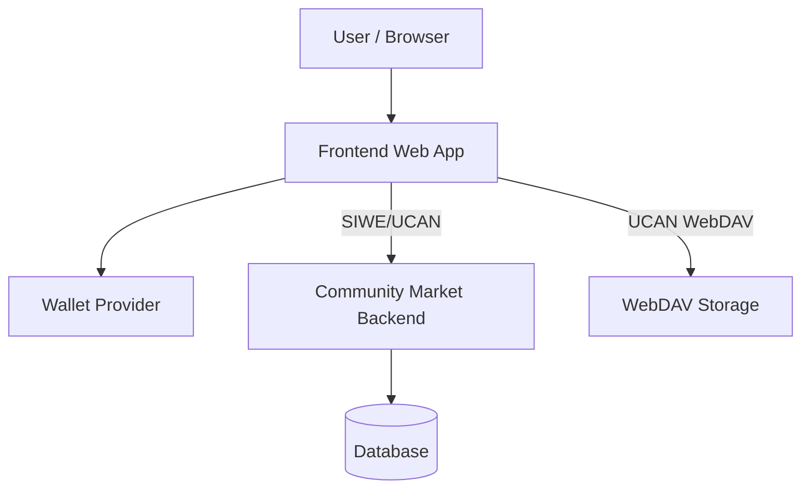

# Architecture

## Purpose
The Node service is the backend for the community market. It exposes REST endpoints for applications, services, audits, and related domain data, and protects those endpoints with SIWE + UCAN authentication.

## Components
- **API Server (Express)**: routes all `/api/v1/*` endpoints.
- **Auth Middleware**: validates `Authorization: Bearer <JWT|UCAN>` for protected routes.
- **SIWE Auth Routes**: `POST /api/v1/public/auth/*` to issue JWTs (access + refresh).
- **UCAN Verification**: validates `aud`, `cap`, `exp`, and proof chain for UCAN tokens.
- **HTTP Routes**: REST handlers under `src/routes/*` grouped by `public/admin/internal`.
- **Database**: TypeORM entities for core market data (applications, services, audits, users, etc.).
- **Storage (Client-side)**: file storage is handled by the frontend via WebDAV; backend does not proxy storage.

## High-Level Data Flow
- Clients authenticate via SIWE or UCAN and receive/use tokens.
- Clients call market APIs with `Authorization: Bearer <token>`.
- The server enforces auth and handles domain logic, persisting to the database.
- File uploads are done directly by the frontend to WebDAV using UCAN.

## System Context (Mermaid)

