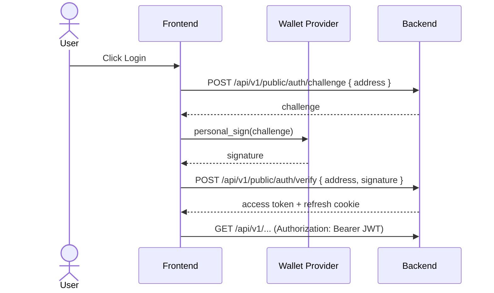
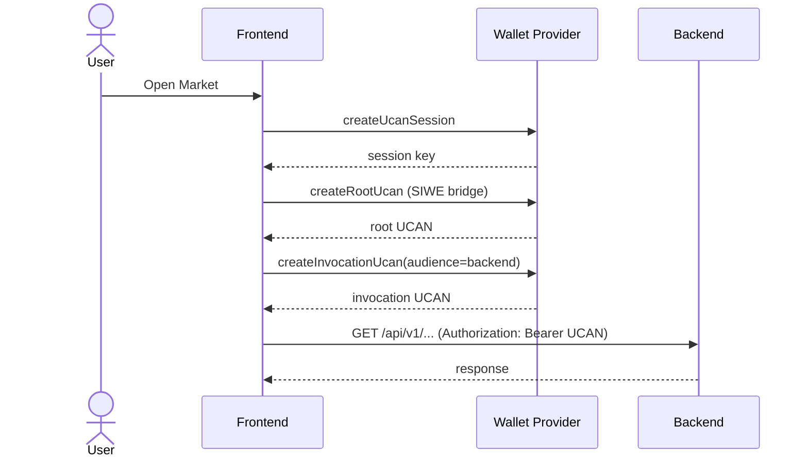

# Authentication & Authorization

This backend supports **SIWE (JWT)** and **UCAN**. Both are accepted via `Authorization: Bearer <token>`.

## SIWE (JWT) Flow
- Challenge/response based login.
- Backend issues access token and refresh cookie.

## UCAN Flow
- Session key generated by wallet.
- Root UCAN created via SIWE bridge.
- Invocation UCAN generated per audience (backend or WebDAV).

## Authorization Rules (UCAN)
Backend requires:
- `aud` equals `UCAN_AUD` (exact match)
- capability includes `{ resource: UCAN_RESOURCE, action: UCAN_ACTION }`
- token `exp` is valid and proof chain passes

## Configuration
Server env:
- `UCAN_AUD` (e.g. `did:web:localhost:8991`)
- `UCAN_RESOURCE` / `UCAN_ACTION`
- `JWT_SECRET` / `ACCESS_TTL_MS` / `REFRESH_TTL_MS`
- `COOKIE_SAMESITE` / `COOKIE_SECURE`

Client env (web):
- `VITE_UCAN_AUD` (preferred, explicit)
- `VITE_UCAN_RESOURCE` / `VITE_UCAN_ACTION`
- `VITE_NODE_API_ENDPOINT`

## Common Errors
- **UCAN audience mismatch**: UCAN `aud` does not equal server `UCAN_AUD`.
- **UCAN expired**: token `exp` is in the past.
- **Capability denied**: UCAN `cap` does not include required `resource/action`.
