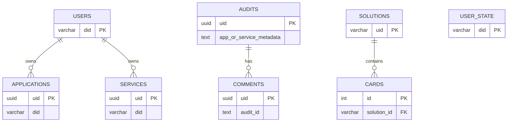

# Data Schema (Core Tables)

This section is based on TypeORM definitions in `src/domain/mapper/entity.ts`.

> Field types may differ slightly at runtime; use migrations/DDL as the source of truth.

## ER Diagram (Overview)

## users
| Field | Type | Notes |
| --- | --- | --- |
| did | varchar(128) PK | User DID |
| name | varchar(128) | Display name |
| avatar | text | Avatar |
| created_at | varchar(64) | Created time |
| updated_at | varchar(64) | Updated time |
| signature | varchar(192) | Signature (not verified) |

## user_state
| Field | Type | Notes |
| --- | --- | --- |
| did | varchar(128) PK | User DID |
| role | varchar(64) | Role |
| status | varchar(64) | Status |
| created_at | varchar(64) | Created time |
| updated_at | varchar(64) | Updated time |
| signature | varchar(192) | Signature (not verified) |

## services
| Field | Type | Notes |
| --- | --- | --- |
| uid | uuid PK | Service ID |
| did | varchar(128) | Service DID |
| version | int | Version |
| owner | varchar(128) | Owner DID |
| owner_name | varchar(128) | Owner name |
| network | varchar(64) | Network |
| address | varchar(128) | Address |
| name | varchar(64) | Name |
| description | text | Description |
| code | varchar(64) | Service code |
| api_codes | text | API codes (comma-separated) |
| proxy | varchar(256) | Proxy endpoint |
| grpc | varchar(256) | gRPC endpoint |
| avatar | text | Avatar |
| created_at | varchar(64) | Created time |
| updated_at | varchar(64) | Updated time |
| signature | varchar(192) | Signature (not verified) |
| code_package_path | text | Package path |
| status | varchar(64) | Business status (BUSINESS_STATUS_*) |
| is_online | boolean | Online flag |

## applications
| Field | Type | Notes |
| --- | --- | --- |
| uid | uuid PK | Application ID |
| did | varchar(128) | Application DID |
| version | int | Version |
| owner | varchar(128) | Owner DID |
| owner_name | varchar(128) | Owner name |
| network | varchar(64) | Network |
| address | varchar(128) | Address |
| name | varchar(64) | Name |
| description | text | Description |
| code | varchar(64) | Application code |
| location | text | Location / entry |
| service_codes | text | Service codes (comma-separated) |
| avatar | text | Avatar |
| created_at | varchar(64) | Created time |
| updated_at | varchar(64) | Updated time |
| signature | varchar(192) | Signature (not verified) |
| code_package_path | text | Package path |
| status | varchar(64) | Business status (BUSINESS_STATUS_*) |
| is_online | boolean | Online flag |

## audits
| Field | Type | Notes |
| --- | --- | --- |
| uid | uuid PK | Ticket ID |
| app_or_service_metadata | text | Metadata JSON |
| audit_type | text | application / service |
| applicant | text | applicant (did::name) |
| approver | text | approvers list (JSON/string) |
| reason | text | Reason |
| created_at | timestamp | Created time |
| updated_at | timestamp | Updated time |
| signature | varchar(192) | Signature (not verified) |
| target_type | varchar(32) | Target type (application/service) |
| target_did | varchar(128) | Target DID |
| target_version | int | Target version |
| target_name | varchar(128) | Target name |

## comments
| Field | Type | Notes |
| --- | --- | --- |
| uid | uuid PK | Comment ID |
| audit_id | text | audits.uid |
| text | text | Comment |
| status | text | approve/reject |
| created_at | varchar(64) | Created time |
| updated_at | varchar(64) | Updated time |
| signature | varchar(192) | Signature (not verified) |

## invitations
| Field | Type | Notes |
| --- | --- | --- |
| code | varchar(64) PK | Invite code |
| scene | varchar(64) | Scene |
| inviter | varchar(128) | Inviter DID |
| invitee | varchar(128) | Invitee DID |
| expired_at | varchar(64) | Expiry |
| created_at | varchar(64) | Created time |
| signature | varchar(192) | Signature |

## events
| Field | Type | Notes |
| --- | --- | --- |
| uid | varchar(128) PK | Event ID |
| type | varchar(64) | Event type |
| producers | text | Producers |
| consumers | text | Consumers |
| signatures | text | Signatures |
| content | text | Content |
| opinions | text | Opinions |
| extend | text | Extended fields |
| created_at | varchar(64) | Created time |
| processed_at | varchar(64) | Processed time |

## certificates
| Field | Type | Notes |
| --- | --- | --- |
| domain | varchar(256) PK | Domain |
| service_did | varchar(128) | Service DID |
| cert | text | Certificate |
| csr | text | CSR |
| expired | varchar(64) | Expiry |
| created_at | varchar(64) | Created time |
| updated_at | varchar(64) | Updated time |

## supports
| Field | Type | Notes |
| --- | --- | --- |
| id | int PK | Auto increment |
| did | varchar(128) | User DID |
| email | varchar(256) | Email |
| type | varchar(64) | Type |
| description | text | Description |
| created_at | varchar(64) | Created time |
| signature | varchar(192) | Signature |
| updated_at | timestamp | Updated time |

## solutions / cards
- `solutions` is the parent table; `cards` is a child table (1:N).
- `cards.solution_id` references `solutions.uid`.
