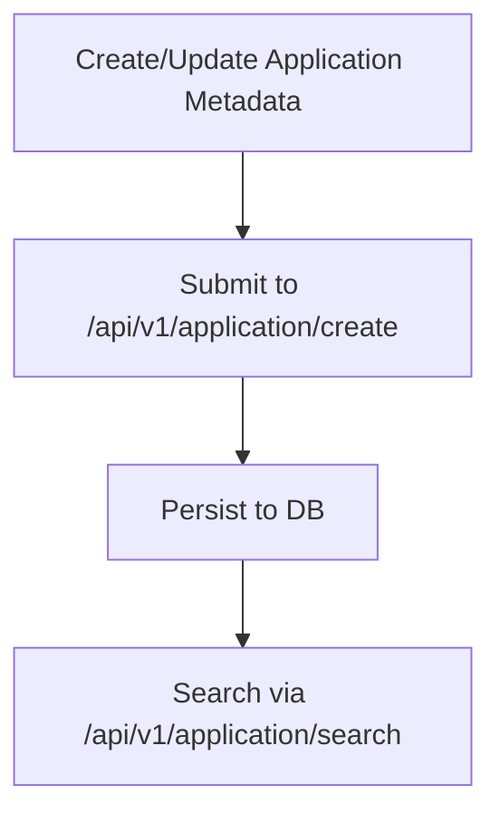
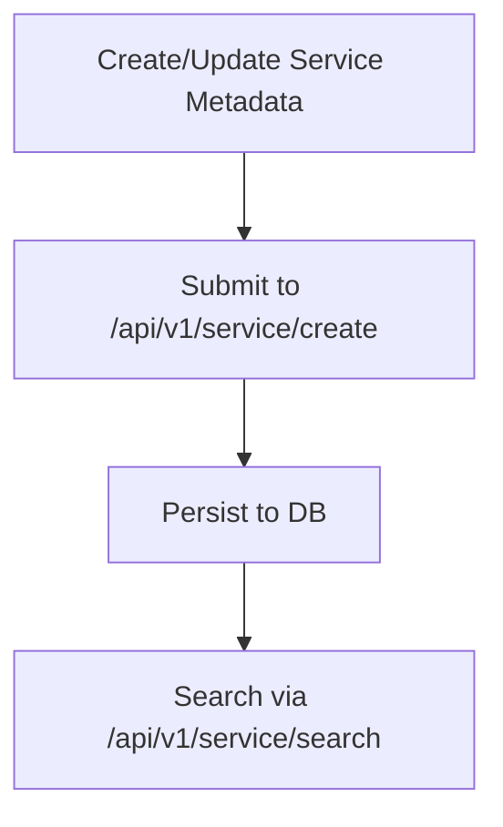

# Market Domain Workflows

This backend implements the community market lifecycle for applications and services. Below are the core flows.

## Application Publish & Search


## Service Publish & Search


## Apply & Audit (Approval)
```mermaid
flowchart TD
  A[Applicant submits apply metadata]
  B[/api/v1/audit/create]
  C[Auditor reviews]
  D{Approve?}
  E[/api/v1/audit/approve]
  F[/api/v1/audit/reject]
  G[Update audit status]

  A --> B --> C --> D
  D -- Yes --> E --> G
  D -- No --> F --> G
```

## Notes
- All market APIs require `Authorization: Bearer <JWT|UCAN>`.
- Identity/signature verification is currently disabled in the backend (no-op).
