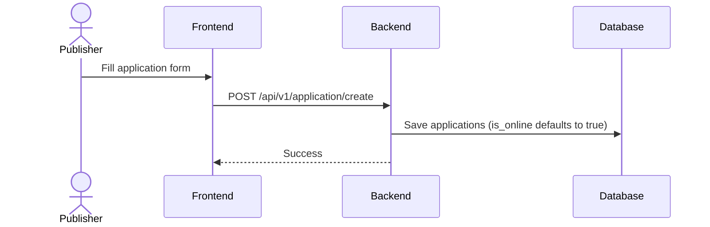
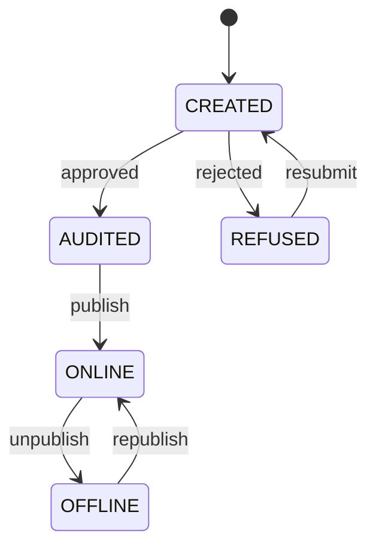
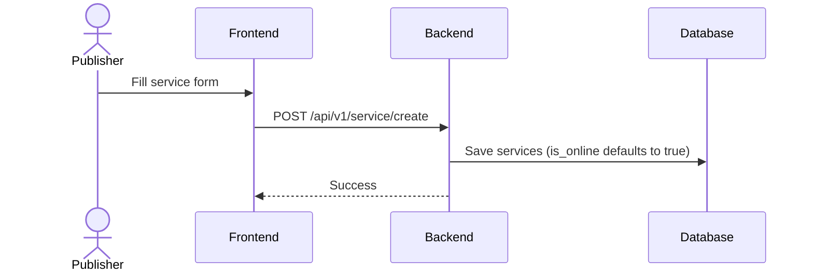
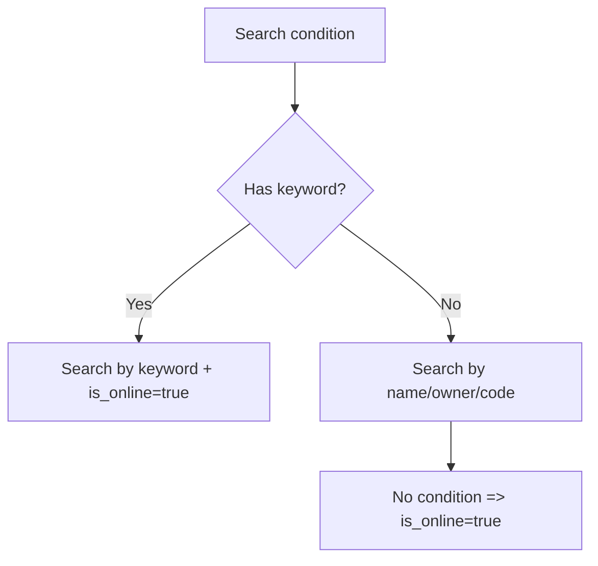

# Business Workflows (Detailed)

This section describes the core market workflows and key implementation details.

## 1) Application Publish


### Notes
- `applications.is_online` is set to `true` on create (`convertApplicationTo`).
- Audit approval is **not enforced** before going online.

### Application Lifecycle (Target Model)
> Note: this is a logical state machine; current implementation only uses `is_online`.


## 2) Service Publish


### Notes
- `services.is_online` is set to `true` on create (`convertServiceTo`).
- Online state is currently decoupled from audit results.

### Service Lifecycle (Target Model)


## 3) Audit Flow (Apply & Review)
```mermaid
flowchart TD
  A[Submit application
/audit/create]
  B[Create audits ticket]
  C[Reviewer views
/audit/search]
  D{Decision}
  E[/audit/approve]
  F[/audit/reject]
  G[Write comments
and update audits]

  A --> B --> C --> D
  D -- Approve --> E --> G
  D -- Reject --> F --> G
```

### Notes
- `audits.app_or_service_metadata` stores the target metadata JSON.
- `comments.status` supports `AGREE` / `REJECT` only.
- Audit results currently do **not** automatically toggle `is_online`.

## 4) Search & Filter Flow


### Notes
- With keyword, `is_online=true` is enforced.
- With no condition, `is_online=true` is enforced.
- With name/owner/code filters, `is_online` is **not enforced** today.

## 5) Auth & Permission
- All business APIs require `Authorization: Bearer <JWT|UCAN>`.
- UCAN `aud` must match server `UCAN_AUD` exactly, otherwise 401.
- Role/status checks and signature verification are **not enforced** (see `permissions.md`).
