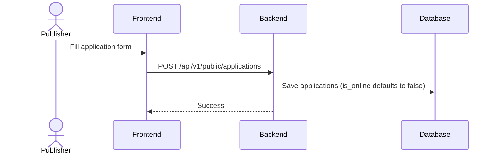
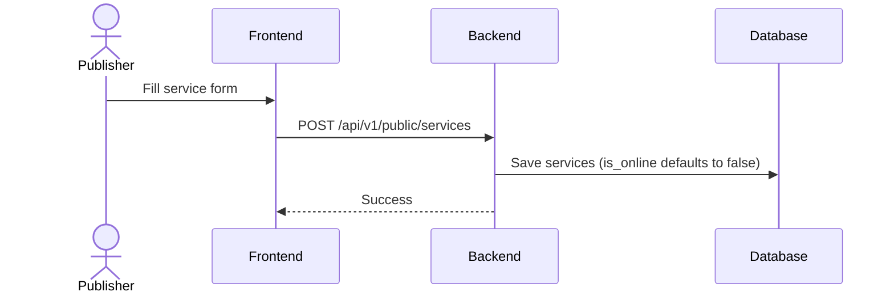
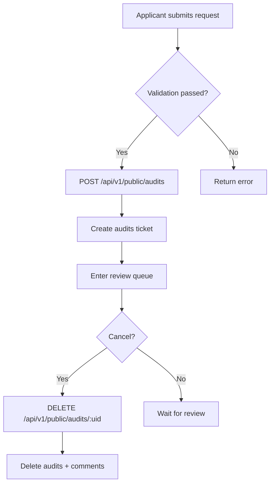
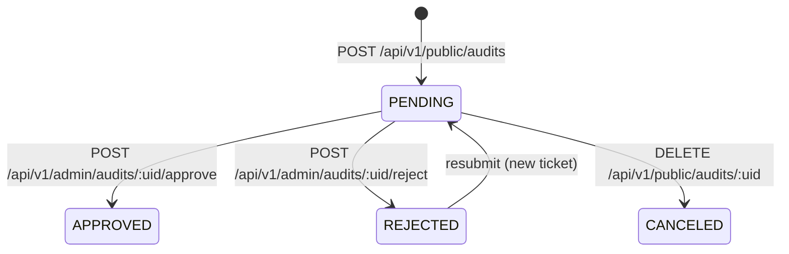

# Business Workflows (Detailed)

This section describes the core market workflows and key implementation details.

## 1) Application Publish


### Notes
- `applications.is_online` is set to `false` on create (`convertApplicationTo`).
- `applications.status` defaults to `BUSINESS_STATUS_PENDING`.
- Approve sets `BUSINESS_STATUS_ONLINE`; reject sets `BUSINESS_STATUS_REJECTED`.

### Application Lifecycle (Target Model)
> Note: `status` + `is_online` are now persisted and driven by `BUSINESS_STATUS_*`.


## 2) Service Publish


### Notes
- `services.is_online` is set to `false` on create (`convertServiceTo`).
- `services.status` defaults to `BUSINESS_STATUS_PENDING`.
- Approve sets `BUSINESS_STATUS_ONLINE`; reject sets `BUSINESS_STATUS_REJECTED`.

### Service Lifecycle (Target Model)


## 3) Apply Flow (Submit/Cancel)


### Notes
- Server checks: target exists, applicant is owner, metadata JSON is valid, no open tickets for the same target.
- `DELETE /api/v1/public/audits/:uid` deletes the ticket and its comments.

## 4) Review Flow (Approve/Reject)
```mermaid
flowchart TD
  A[Reviewer searches tickets
POST /api/v1/public/audits/search]
  B[View detail
GET /api/v1/public/audits/:uid]
  C{Decision}
  D[/api/v1/admin/audits/:uid/approve]
  E[/api/v1/admin/audits/:uid/reject]
  F[Write comments]
  G[Target: update resource status]
  H[Notify/log]

  A --> B --> C
  C -- Approve --> D --> F
  C -- Reject --> E --> F
  F -.-> G
  F --> H
```

### Notes
- `comments.status` supports `COMMENT_STATUS_AGREE` / `COMMENT_STATUS_REJECT` only.
- Approval succeeds when **approvals >= requiredApprovals** and no rejection exists.
- Audit decisions are idempotent: once decided (approved/rejected), further approvals/rejections are rejected.
- Audit results now toggle `is_online`.

### Audit Ticket State Machine (Logical)
> Note: there is no explicit `status` field; state is inferred from comment aggregation (threshold + rejection).


## 5) Publish/Unpublish Flow (Application/Service)
> Note: dedicated publish/unpublish APIs are available (`POST /api/v1/public/applications/:uid/publish`, `POST /api/v1/public/applications/:uid/unpublish`, `POST /api/v1/public/services/:uid/publish`, `POST /api/v1/public/services/:uid/unpublish`).


### Notes
- Publish requires audit approval; only owner/admin can operate.
- Dedicated publish/unpublish endpoints are available; audit results also toggle online state.
- Search and display unify both audit + online states.

### Online State Machine (Logical)


## 6) Search & Filter Flow


### Notes
- `is_online=true` is enforced for all search modes (keyword/name/owner/code).

## 7) Auth & Permission
- All business APIs require `Authorization: Bearer <JWT|UCAN>`.
- UCAN `aud` must match server `UCAN_AUD` exactly, otherwise 401.
- Role/status checks are still **not enforced**; audit signature verification is **enforced** (see `permissions.md`).
