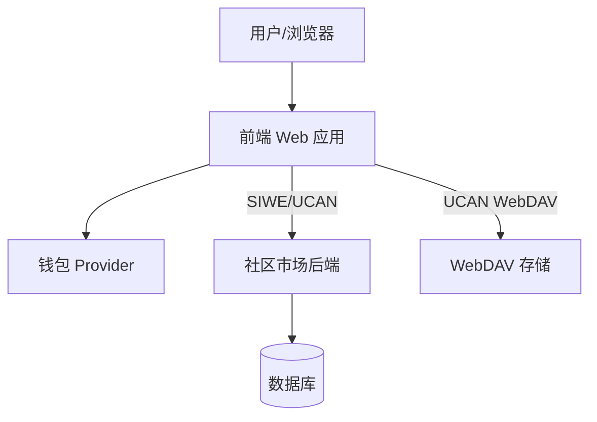

# 架构

## 目标
本 Node 服务是社区市场后端。对外提供 REST 业务接口（应用、服务、审核等），并通过 SIWE + UCAN 进行鉴权。

## 组件
- **API Server (Express)**: 处理 `/api/v1/*` 业务路由。
- **鉴权中间件**: 校验 `Authorization: Bearer <JWT|UCAN>`。
- **SIWE 认证路由**: `POST /api/v1/public/auth/*` 颁发 JWT（access + refresh）。
- **UCAN 校验**: 校验 `aud`、`cap`、`exp` 及证明链。
- **HTTP 路由**: `src/routes/*` 按 `public/admin/internal` 分组。
- **数据库**: TypeORM 实体，存储应用、服务、审核、用户等核心数据。
- **存储（前端直连）**: 文件上传由前端通过 WebDAV 处理，后端不再代理。

## 高层数据流
- 客户端通过 SIWE 或 UCAN 登录。
- 业务接口使用 `Authorization: Bearer <token>`。
- 后端进行鉴权并处理业务逻辑，数据落库。
- 文件上传由前端使用 UCAN 直接访问 WebDAV。

## 系统上下文 (Mermaid)

