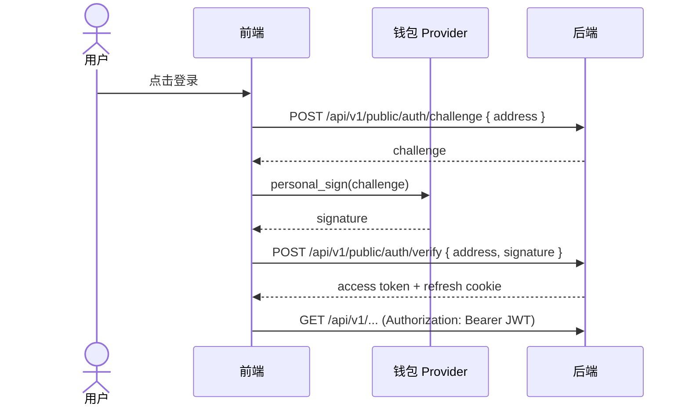
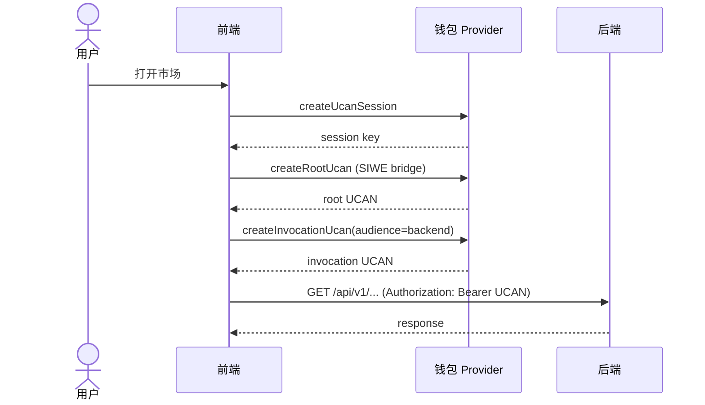

# 认证与鉴权

后端支持 **SIWE (JWT)** 与 **UCAN** 两种鉴权方式，统一使用 `Authorization: Bearer <token>`。

## SIWE (JWT) 流程
- Challenge/Response 登录。
- 后端颁发 access token + refresh cookie。

## UCAN 流程
- 钱包生成 UCAN Session Key。
- 通过 SIWE 生成 Root UCAN。
- 针对后端/WebDAV 生成 Invocation UCAN。

## UCAN 授权规则
后端要求：
- `aud` 等于 `UCAN_AUD`（严格匹配）
- capability 包含 `{ resource: UCAN_RESOURCE, action: UCAN_ACTION }`
- `exp` 有效且证明链可验证

## 配置
服务端环境变量：
- `UCAN_AUD`（例如 `did:web:localhost:8991`）
- `UCAN_RESOURCE` / `UCAN_ACTION`
- `JWT_SECRET` / `ACCESS_TTL_MS` / `REFRESH_TTL_MS`
- `COOKIE_SAMESITE` / `COOKIE_SECURE`

前端环境变量：
- `VITE_UCAN_AUD`（推荐显式配置）
- `VITE_UCAN_RESOURCE` / `VITE_UCAN_ACTION`
- `VITE_NODE_API_ENDPOINT`

## 常见错误
- **UCAN audience mismatch**: UCAN `aud` 与后端 `UCAN_AUD` 不一致。
- **UCAN expired**: token 过期。
- **Capability denied**: `cap` 不包含后端要求的 `resource/action`。
