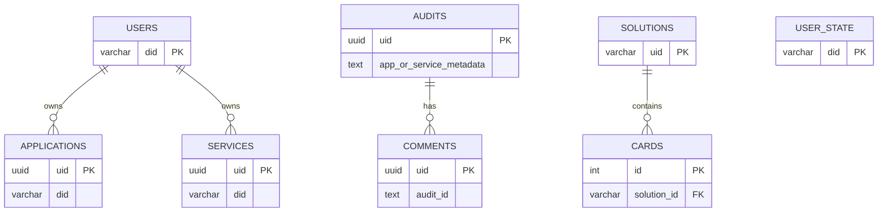

# 数据表结构（核心）

本节基于 `src/domain/mapper/entity.ts` 的 TypeORM 定义，描述主要数据表结构。

> 字段类型与数据库实际类型可能有细微差异，请以迁移/实际建表为准。

## ER 图（概览）

## users
| 字段 | 类型 | 说明 |
| --- | --- | --- |
| did | varchar(128) PK | 用户 DID |
| name | varchar(128) | 昵称 |
| avatar | text | 头像 |
| created_at | varchar(64) | 创建时间 |
| updated_at | varchar(64) | 更新时间 |
| signature | varchar(192) | 签名（当前未校验） |

## user_state
| 字段 | 类型 | 说明 |
| --- | --- | --- |
| did | varchar(128) PK | 用户 DID |
| role | varchar(64) | 角色 |
| status | varchar(64) | 状态 |
| created_at | varchar(64) | 创建时间 |
| updated_at | varchar(64) | 更新时间 |
| signature | varchar(192) | 签名（当前未校验） |

## services
| 字段 | 类型 | 说明 |
| --- | --- | --- |
| uid | uuid PK | 服务主键 |
| did | varchar(128) | 服务 DID |
| version | int | 版本 |
| owner | varchar(128) | 所有者 DID |
| owner_name | varchar(128) | 所有者名称 |
| network | varchar(64) | 网络 |
| address | varchar(128) | 地址 |
| name | varchar(64) | 名称 |
| description | text | 描述 |
| code | varchar(64) | 服务编码 |
| api_codes | text | API 编码列表（逗号分隔） |
| proxy | varchar(256) | 代理地址 |
| grpc | varchar(256) | gRPC 地址 |
| avatar | text | 头像 |
| created_at | varchar(64) | 创建时间 |
| updated_at | varchar(64) | 更新时间 |
| signature | varchar(192) | 签名（当前未校验） |
| code_package_path | text | 包路径 |
| is_online | boolean | 上架标记 |

## applications
| 字段 | 类型 | 说明 |
| --- | --- | --- |
| uid | uuid PK | 应用主键 |
| did | varchar(128) | 应用 DID |
| version | int | 版本 |
| owner | varchar(128) | 所有者 DID |
| owner_name | varchar(128) | 所有者名称 |
| network | varchar(64) | 网络 |
| address | varchar(128) | 地址 |
| name | varchar(64) | 名称 |
| description | text | 描述 |
| code | varchar(64) | 应用编码 |
| location | text | 应用位置/入口 |
| hash | varchar(128) | 资源哈希 |
| service_codes | text | 依赖服务编码（逗号分隔） |
| avatar | text | 头像 |
| created_at | varchar(64) | 创建时间 |
| updated_at | varchar(64) | 更新时间 |
| signature | varchar(192) | 签名（当前未校验） |
| code_package_path | text | 包路径 |
| is_online | boolean | 上架标记 |

## audits
| 字段 | 类型 | 说明 |
| --- | --- | --- |
| uid | uuid PK | 工单主键 |
| app_or_service_metadata | text | 申请对象元数据 JSON |
| audit_type | text | 审批类型（application/service） |
| applicant | text | 申请人（did::name） |
| approver | text | 审核人列表（JSON 或拼接字符串） |
| reason | text | 申请原因 |
| created_at | timestamp | 创建时间 |
| updated_at | timestamp | 更新时间 |
| signature | varchar(192) | 签名（当前未校验） |

## comments
| 字段 | 类型 | 说明 |
| --- | --- | --- |
| uid | uuid PK | 评论主键 |
| audit_id | text | 关联 audits.uid |
| text | text | 审批意见 |
| status | text | 审批状态（agree/reject） |
| created_at | varchar(64) | 创建时间 |
| updated_at | varchar(64) | 更新时间 |
| signature | varchar(192) | 签名（当前未校验） |

## invitations
| 字段 | 类型 | 说明 |
| --- | --- | --- |
| code | varchar(64) PK | 邀请码 |
| scene | varchar(64) | 场景 |
| inviter | varchar(128) | 邀请人 DID |
| invitee | varchar(128) | 被邀请人 DID |
| expired_at | varchar(64) | 过期时间 |
| created_at | varchar(64) | 创建时间 |
| signature | varchar(192) | 签名 |

## events
| 字段 | 类型 | 说明 |
| --- | --- | --- |
| uid | varchar(128) PK | 事件 ID |
| type | varchar(64) | 事件类型 |
| producers | text | 生产者 |
| consumers | text | 消费者 |
| signatures | text | 签名 |
| content | text | 内容 |
| opinions | text | 观点 |
| extend | text | 扩展字段 |
| created_at | varchar(64) | 创建时间 |
| processed_at | varchar(64) | 处理时间 |

## certificates
| 字段 | 类型 | 说明 |
| --- | --- | --- |
| domain | varchar(256) PK | 域名 |
| service_did | varchar(128) | 服务 DID |
| cert | text | 证书 |
| csr | text | CSR |
| expired | varchar(64) | 过期时间 |
| created_at | varchar(64) | 创建时间 |
| updated_at | varchar(64) | 更新时间 |

## supports
| 字段 | 类型 | 说明 |
| --- | --- | --- |
| id | int PK | 自增 ID |
| did | varchar(128) | 用户 DID |
| email | varchar(256) | 邮箱 |
| type | varchar(64) | 类型 |
| description | text | 描述 |
| created_at | varchar(64) | 创建时间 |
| signature | varchar(192) | 签名 |
| updated_at | timestamp | 更新时间 |

## solutions / cards
- `solutions`：解决方案主表，`cards` 为其子表（一对多）。
- `cards.solution_id` 外键指向 `solutions.uid`。
