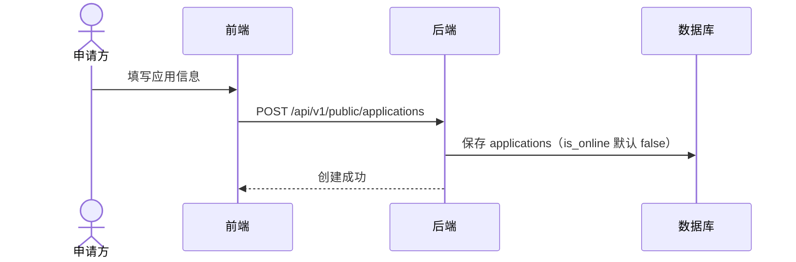
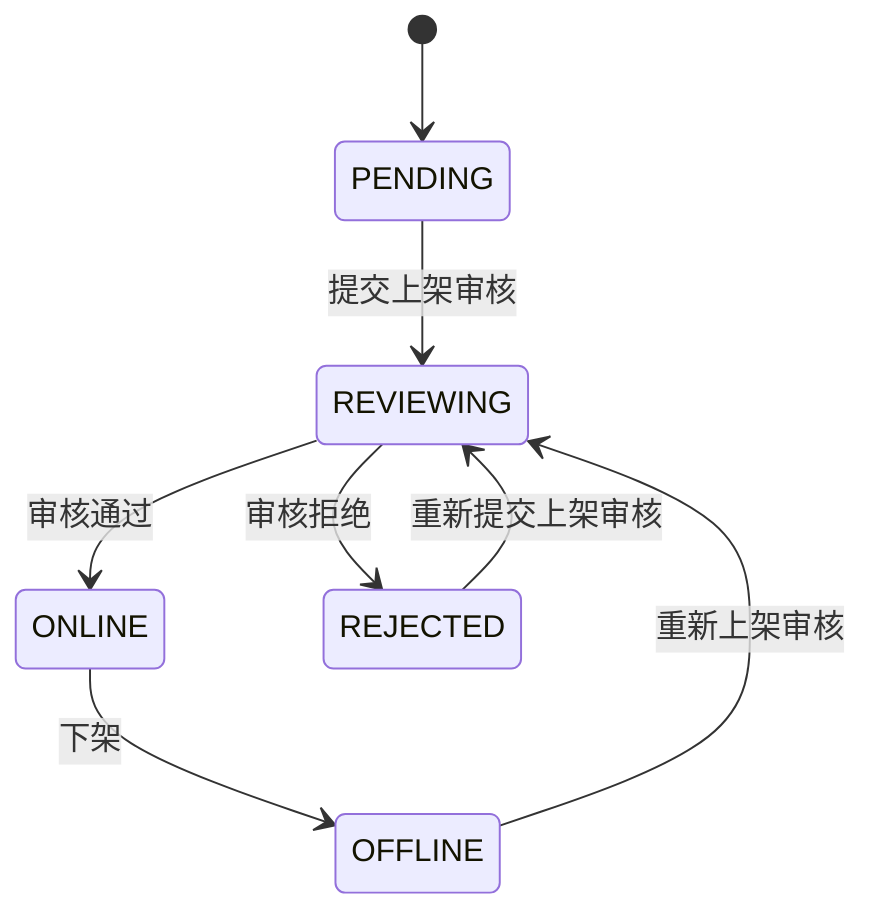
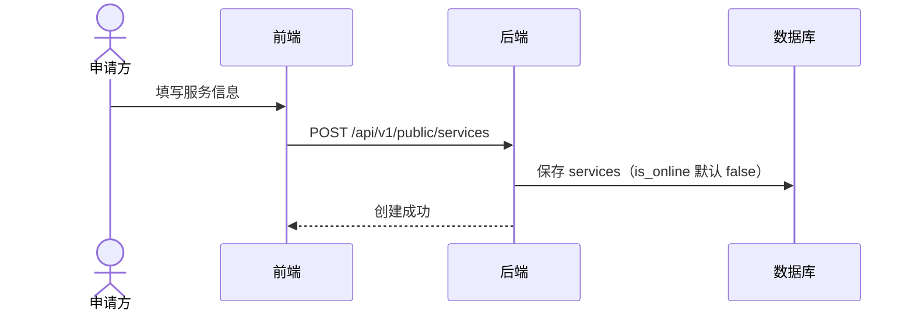
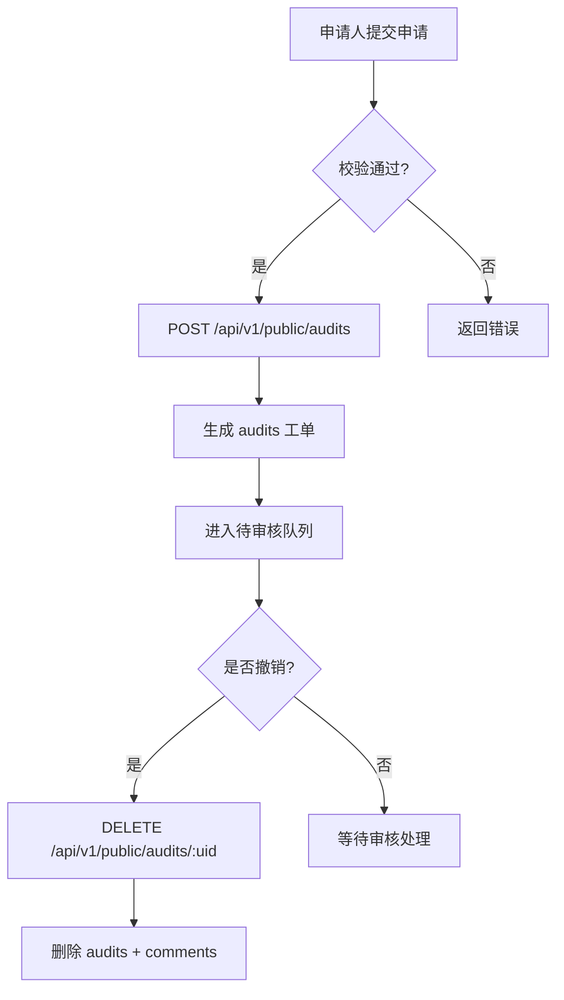
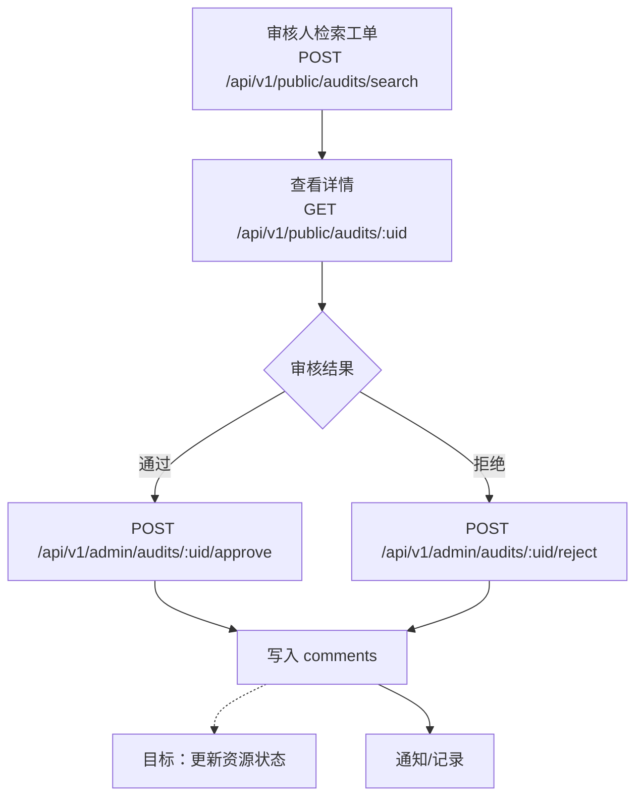
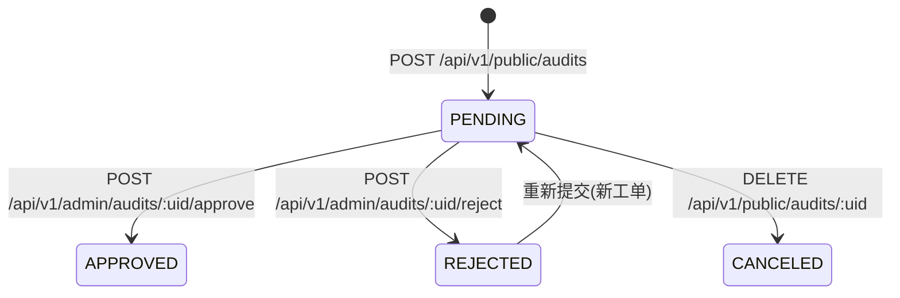
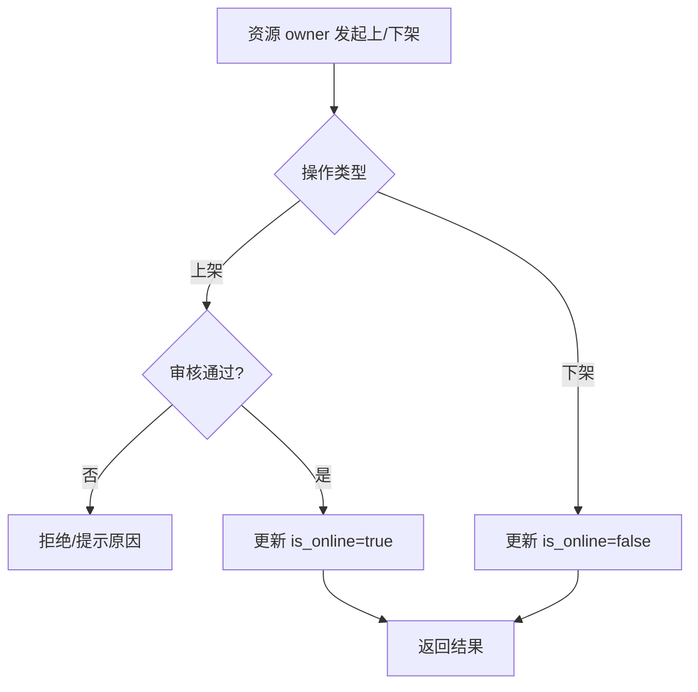
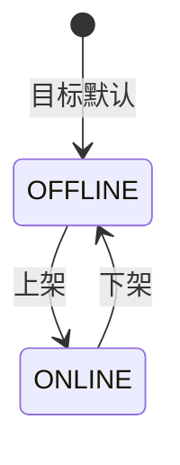
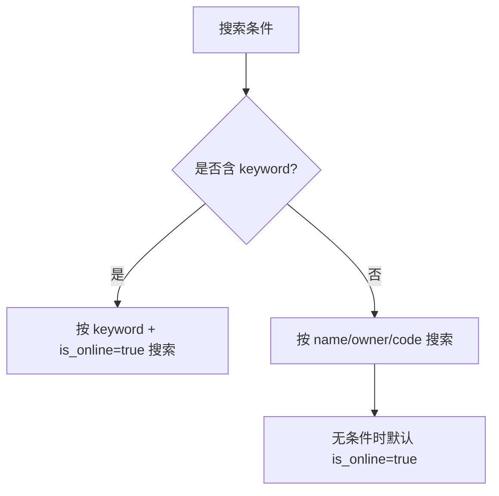

# 业务流程（细化）

本节描述社区市场的核心业务流程与当前实现的关键细节。

## 1) 应用发布流程

### 关键点
- `applications.is_online` 在创建时被设置为 `false`（`convertApplicationTo`）。
- `applications.status` 默认 `BUSINESS_STATUS_PENDING`。
- 审核通过置为 `BUSINESS_STATUS_ONLINE`，拒绝置为 `BUSINESS_STATUS_REJECTED`。

### 应用生命周期（目标模型）
> 说明：已落地 `status` + `is_online`；审核流程围绕 `BUSINESS_STATUS_*` 运行。

## 2) 服务发布流程

### 关键点
- `services.is_online` 在创建时被设置为 `false`（`convertServiceTo`）。
- `services.status` 默认 `BUSINESS_STATUS_PENDING`。
- 审核通过置为 `BUSINESS_STATUS_ONLINE`，拒绝置为 `BUSINESS_STATUS_REJECTED`。

### 服务生命周期（目标模型）

## 3) 申请流程（提交/撤销）

### 关键点
- 服务端校验：资源存在、申请人是 owner、元数据 JSON 可解析、同一资源的未结工单不可重复提交。
- `DELETE /api/v1/public/audits/:uid` 会删除工单与其评论（`audits` + `comments`）。

## 4) 审核流程（审批/拒绝）

### 关键点
- `comments.status` 仅支持 `COMMENT_STATUS_AGREE` / `COMMENT_STATUS_REJECT`。
- 审核通过条件：**同意数 >= requiredApprovals** 且无拒绝记录。
- 审核单已做幂等限制：已通过/已驳回后不允许再次审批。
- 审核结果会同步更新应用/服务 `is_online`。

### 审核工单状态机（逻辑）
> 说明：审核单无显式 `status` 字段，可由 comment 聚合（阈值 + 驳回）推断。

## 5) 上架/下架流程（应用/服务）
> 说明：已提供独立上/下架接口（`POST /api/v1/public/applications/:uid/publish`、`POST /api/v1/public/applications/:uid/unpublish`、`POST /api/v1/public/services/:uid/publish`、`POST /api/v1/public/services/:uid/unpublish`）。

### 关键点
- 上线需审核通过，且仅 owner/管理员可操作。
- 已提供独立上/下架接口，审核通过后可上线；下架为手动触发。
- 搜索与展示统一使用“审核 + 上线”状态组合。

### 上下架状态机（逻辑）

## 6) 查询流程（搜索与过滤）

### 关键点
- 任意搜索均默认 `is_online=true`（包含 keyword / name / owner / code）。

## 7) 认证与权限
- 所有业务接口要求 `Authorization: Bearer <JWT|UCAN>`。
- UCAN `aud` 必须与服务端 `UCAN_AUD` 匹配，否则 401。
- 角色/状态权限校验仍**未强制**；上架申请/审核签名已**强制**（详见 `permissions.md`）。
