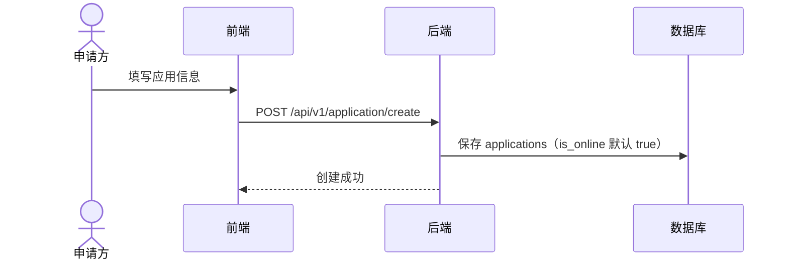
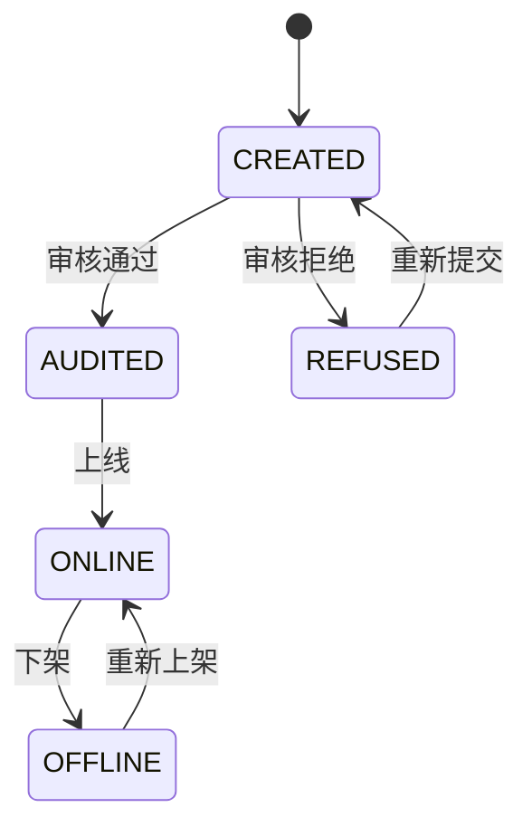
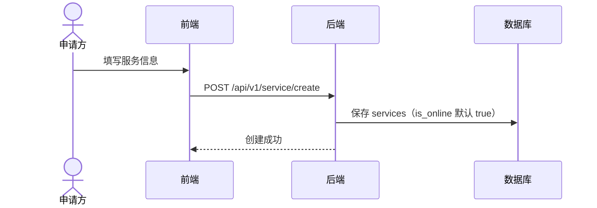
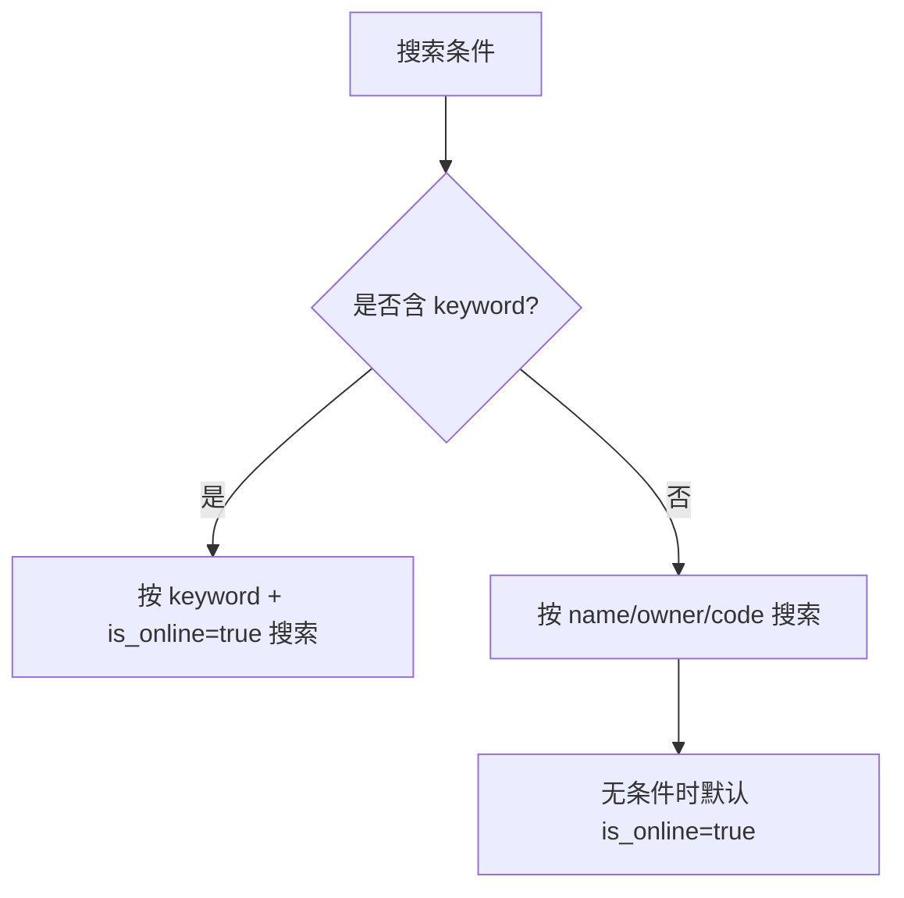

# 业务流程（细化）

本节描述社区市场的核心业务流程与当前实现的关键细节。

## 1) 应用发布流程


### 关键点
- `applications.is_online` 在创建时被设置为 `true`（`convertApplicationTo`）。
- 后端目前**未强制**“审核通过后才上线”的逻辑。

### 应用生命周期（目标模型）
> 说明：以下为逻辑状态机；当前实现只使用 `is_online`，未完整体现状态流转。


## 2) 服务发布流程


### 关键点
- `services.is_online` 在创建时被设置为 `true`（`convertServiceTo`）。
- 当前实现中，服务上架不依赖审核结果。

### 服务生命周期（目标模型）


## 3) 审核流程（申请/审批）
```mermaid
flowchart TD
  A[提交申请
/audit/create]
  B[生成 audits 工单]
  C[审核人查看工单
/audit/search]
  D{审核结果}
  E[/audit/approve]
  F[/audit/reject]
  G[写入 comments
并更新 audits]

  A --> B --> C --> D
  D -- 通过 --> E --> G
  D -- 拒绝 --> F --> G
```

### 关键点
- `audits.app_or_service_metadata` 存储被申请对象的元数据 JSON。
- `comments.status` 仅支持 `AGREE` / `REJECT`。
- 审核流程与应用/服务“上线状态”**当前是松耦合**（未自动切换 `is_online`）。

## 4) 查询流程（搜索与过滤）


### 关键点
- 有 keyword 时强制 `is_online=true`。
- 无条件时默认 `is_online=true`。
- 使用 name/owner/code 搜索时，当前实现**不会强制** `is_online=true`。

## 5) 认证与权限
- 所有业务接口要求 `Authorization: Bearer <JWT|UCAN>`。
- UCAN `aud` 必须与服务端 `UCAN_AUD` 匹配，否则 401。
- 角色/状态权限校验与签名校验**目前未强制**（详见 `permissions.md`）。
