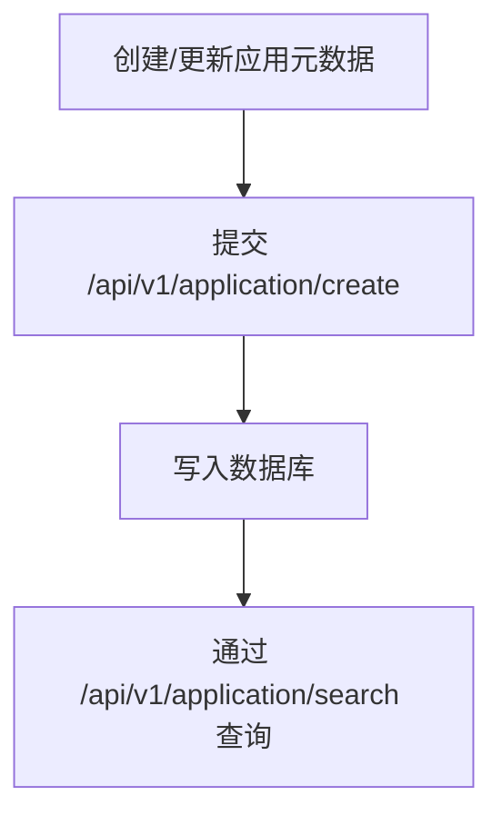
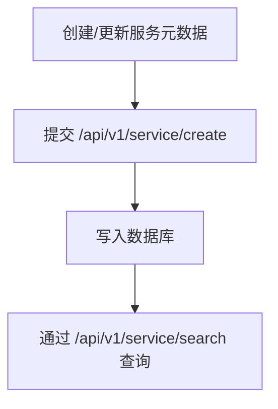

# 业务流程

社区市场后端核心流程如下。

## 应用发布与查询


## 服务发布与查询


## 申请与审核
```mermaid
flowchart TD
  A[申请方提交申请]
  B[/api/v1/audit/create]
  C[审核方处理]
  D{是否通过}
  E[/api/v1/audit/approve]
  F[/api/v1/audit/reject]
  G[更新审核状态]

  A --> B --> C --> D
  D -- 是 --> E --> G
  D -- 否 --> F --> G
```

## 备注
- 所有业务接口均要求 `Authorization: Bearer <JWT|UCAN>`。
- 身份/签名校验逻辑当前已停用（no-op）。
