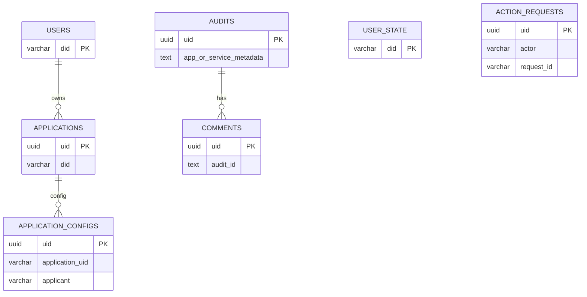

# 数据表结构（核心）

本节基于 `src/domain/mapper/entity.ts` 的 TypeORM 定义，描述主要数据表结构。

> 字段类型与数据库实际类型可能有细微差异，请以迁移/实际建表为准。

## ER 图（概览）

## users
| 字段 | 类型 | 说明 |
| --- | --- | --- |
| did | varchar(128) PK | 用户 DID |
| name | varchar(128) | 昵称 |
| avatar | text | 头像 |
| created_at | varchar(64) | 创建时间 |
| updated_at | varchar(64) | 更新时间 |
| signature | varchar(192) | 签名（当前未校验） |

## user_state
| 字段 | 类型 | 说明 |
| --- | --- | --- |
| did | varchar(128) PK | 用户 DID |
| role | varchar(64) | 角色 |
| status | varchar(64) | 状态 |
| created_at | varchar(64) | 创建时间 |
| updated_at | varchar(64) | 更新时间 |
| signature | varchar(192) | 签名（当前未校验） |

说明：
- 首次认证成功或首次命中活跃校验时，后端会自动创建 `user_state`
- 默认值为 `role=USER_ROLE_NORMAL`、`status=USER_STATUS_ACTIVE`
- 历史 `USER_ROLE_UNKNOWN` 账号会在再次登录或命中活跃校验时自动升级为 `USER_ROLE_NORMAL`

## action_requests
| 字段 | 类型 | 说明 |
| --- | --- | --- |
| uid | uuid PK | 主键 |
| actor | varchar(128) | 请求发起人地址 |
| action | varchar(64) | 业务动作 |
| request_id | varchar(128) | 请求 nonce / requestId |
| payload_hash | varchar(64) | 参与签名的 payload 哈希 |
| signed_at | varchar(64) | 签名时间 |
| signature | varchar(192) | 钱包签名 |
| created_at | varchar(64) | 服务端消费时间 |
| status | varchar(32) | 幂等记录状态（`pending` / `completed`） |
| response_code | int | 首次响应的 HTTP 状态码 |
| response_body | text | 首次响应的序列化响应体 |
| completed_at | varchar(64) | 首次完成时间 |

说明：
- 对 `(actor, request_id)` 做唯一约束（索引 `idx_action_request_dedup`）
- 业务写接口会先写入 `pending` 记录，完成后回填响应
- 同一 `(actor, request_id)` 的重复请求可直接回放首个已完成响应
- 后台清理任务会删除过期完成记录与超时 `pending` 记录，避免表无限增长

## applications
| 字段 | 类型 | 说明 |
| --- | --- | --- |
| uid | uuid PK | 应用主键 |
| did | varchar(128) | 应用 DID |
| version | int | 版本 |
| owner | varchar(128) | 所有者 DID |
| owner_name | varchar(128) | 所有者名称 |
| network | varchar(64) | 网络 |
| address | varchar(128) | 地址 |
| name | varchar(64) | 名称 |
| description | text | 描述 |
| code | varchar(64) | 应用编码 |
| location | text | 应用位置/入口 |
| service_codes | text | 依赖能力编码（逗号分隔） |
| redirect_uris | text | 中心化 UCAN 授权回跳白名单（JSON 数组字符串） |
| avatar | text | 头像 |
| created_at | varchar(64) | 创建时间 |
| updated_at | varchar(64) | 更新时间 |
| signature | varchar(192) | 签名（当前未校验） |
| code_package_path | text | 包路径 |
| status | varchar(64) | 业务状态（BUSINESS_STATUS_*） |
| is_online | boolean | 上架标记 |

说明：
- `redirect_uris` 为空时，该应用不可用于中心化 UCAN 的 `authorize` 流程。
- `redirect_uris` 建议存储完整 HTTPS 回跳地址列表，服务端按精确匹配校验 `redirectUri`。

## application_configs
| 字段 | 类型 | 说明 |
| --- | --- | --- |
| uid | uuid PK | 配置主键 |
| application_uid | varchar(64) | 应用 UID |
| application_did | varchar(128) | 应用 DID |
| application_version | int | 应用版本 |
| applicant | varchar(128) | 申请人地址 |
| config_json | text | 配置 JSON（code/instance 列表） |
| created_at | varchar(64) | 创建时间 |
| updated_at | varchar(64) | 更新时间 |

## audits
| 字段 | 类型 | 说明 |
| --- | --- | --- |
| uid | uuid PK | 工单主键 |
| app_or_service_metadata | text | 申请对象元数据 JSON |
| audit_type | text | 审批类型（当前 application，contract 预留） |
| applicant | text | 申请人（did::name） |
| approver | text | 审核策略（JSON 对象或列表）；对象形如 `{ "approvers": [...], "requiredApprovals": 2 }` |
| reason | text | 申请原因 |
| created_at | timestamp | 创建时间 |
| updated_at | timestamp | 更新时间 |
| signature | varchar(192) | 签名（当前未校验） |
| target_type | varchar(32) | 目标类型（当前 application，contract 预留） |
| target_did | varchar(128) | 目标 DID |
| target_version | int | 目标版本 |
| target_name | varchar(128) | 目标名称 |
| previous_target_status | varchar(64) | 提交审核前的资源状态，用于撤销恢复 |
| previous_target_is_online | boolean | 提交审核前的上架标记，用于撤销恢复 |

说明：
- `target_type + target_did + target_version` 上有组合索引 `idx_audit_target`，用于同资源审核单去重和检索
- `target_*` 字段是从审核元数据冗余出来的索引列，避免依赖 JSON 模糊匹配
- `previous_target_*` 用于撤销“上架申请”时恢复资源提交前状态，不用于“申请使用”
- 审核单本身没有显式 `status` 列；前端/接口返回的“待审批 / 审批通过 / 审批驳回”来自 `comments` 聚合

## comments
| 字段 | 类型 | 说明 |
| --- | --- | --- |
| uid | uuid PK | 评论主键 |
| audit_id | text | 关联 audits.uid |
| text | text | 审批意见 |
| status | text | 审批状态（COMMENT_STATUS_AGREE / COMMENT_STATUS_REJECT） |
| created_at | varchar(64) | 创建时间 |
| updated_at | varchar(64) | 更新时间 |
| signature | varchar(192) | 签名（当前未校验） |

说明：
- 每条记录表示一次审批意见；审批通过/驳回由 `status` 表达
- 当前未建立数据库级外键；审核单撤销时由业务层显式删除关联 `comments`

## mpc_sessions
| 字段 | 类型 | 说明 |
| --- | --- | --- |
| id | varchar(64) PK | 会话 ID |
| type | varchar(16) | keygen/sign/refresh |
| wallet_id | varchar(128) | 钱包 ID |
| threshold | int | 门限 |
| participants | text | 参与者列表 JSON |
| status | varchar(32) | 会话状态 |
| round | int | 当前轮次 |
| curve | varchar(32) | 曲线 |
| key_version | int | 公钥版本 |
| share_version | int | share 版本 |
| created_at | varchar(64) | 创建时间（epoch ms） |
| expires_at | varchar(64) | 过期时间（epoch ms） |

## mpc_session_participants
| 字段 | 类型 | 说明 |
| --- | --- | --- |
| uid | uuid PK | 参与者主键 |
| session_id | varchar(64) | 会话 ID |
| participant_id | varchar(64) | 成员 ID |
| device_id | varchar(128) | 设备指纹 |
| identity | varchar(256) | 身份（did） |
| e2e_public_key | text | E2E 公钥 |
| signing_public_key | text | 签名公钥 |
| status | varchar(32) | 状态 |
| joined_at | varchar(64) | 加入时间（epoch ms） |

## mpc_messages
| 字段 | 类型 | 说明 |
| --- | --- | --- |
| id | varchar(64) PK | 消息 ID |
| session_id | varchar(64) | 会话 ID |
| sender | varchar(64) | 发送方 |
| receiver | varchar(64) | 接收方（可空） |
| round | int | 轮次 |
| type | varchar(64) | 消息类型 |
| seq | int | 序号 |
| envelope | text | 加密信封 JSON |
| created_at | varchar(64) | 创建时间（epoch ms） |

## mpc_sign_requests
| 字段 | 类型 | 说明 |
| --- | --- | --- |
| id | varchar(64) PK | 请求 ID |
| wallet_id | varchar(128) | 钱包 ID |
| session_id | varchar(64) | 会话 ID |
| initiator | varchar(64) | 发起人 |
| payload_type | varchar(32) | 负载类型 |
| payload_hash | varchar(256) | 负载哈希 |
| chain_id | int | 链 ID |
| status | varchar(32) | 状态 |
| approvals | text | 审批列表 JSON |
| created_at | varchar(64) | 创建时间（epoch ms） |

## mpc_audit_logs
| 字段 | 类型 | 说明 |
| --- | --- | --- |
| id | varchar(64) PK | 日志 ID |
| wallet_id | varchar(128) | 钱包 ID |
| session_id | varchar(64) | 会话 ID |
| level | varchar(16) | 级别 |
| action | varchar(64) | 动作 |
| actor | varchar(64) | 操作人 |
| message | text | 描述 |
| time | varchar(64) | 时间（epoch ms） |
| metadata | text | 元数据 JSON |

## notifications
| 字段 | 类型 | 说明 |
| --- | --- | --- |
| uid | uuid PK | 通知主键 |
| type | varchar(128) | 通知类型（如 `audit.approved`） |
| source | varchar(64) | 来源域（application/audit/auth/ucan/totp/mpc/system） |
| subject_type | varchar(64) | 关联对象类型 |
| subject_id | varchar(128) | 关联对象标识 |
| actor | varchar(128) | 触发主体 |
| audience_type | varchar(64) | 受众类型（user/owner/approver/participant/admin/public） |
| audience_ids | text | 受众列表（JSON 数组字符串） |
| level | varchar(16) | 级别（info/success/warning/error） |
| title | varchar(256) | 标题 |
| body | text | 正文 |
| payload | text | 扩展上下文（JSON 字符串） |
| status | varchar(32) | 主状态（pending/delivered/expired） |
| created_at | varchar(64) | 创建时间 |
| updated_at | varchar(64) | 更新时间 |
| expires_at | varchar(64) | 过期时间 |

说明：
- 该表保存“平台级通知事件”的主记录。
- 已落地到实体与迁移：
  - `src/domain/mapper/entity.ts`
  - `src/migrations/20260429110000-add-notifications.ts`
- 当前一期已接入的事件源：
  - `audit.approved`
  - `audit.rejected`
  - `totp.request_approved`
  - `totp.request_expired`

## notification_inboxes
| 字段 | 类型 | 说明 |
| --- | --- | --- |
| uid | uuid PK | 收件箱主键 |
| notification_uid | uuid | 关联通知主键 |
| recipient | varchar(128) | 接收人（did / address） |
| recipient_type | varchar(64) | 接收人类型 |
| is_read | boolean | 是否已读 |
| read_at | varchar(64) | 已读时间 |
| delivered_at | varchar(64) | 送达时间 |
| archived_at | varchar(64) | 归档时间 |
| created_at | varchar(64) | 创建时间 |
| updated_at | varchar(64) | 更新时间 |

说明：
- 该表用于站内通知“按用户视角”维护收件状态。
- 一条通知可对应多个收件箱记录。
- 当前前端读取未读数与通知列表时，直接聚合本表。

## notification_deliveries（设计草案）
| 字段 | 类型 | 说明 |
| --- | --- | --- |
| uid | uuid PK | 投递记录主键 |
| notification_uid | uuid | 关联通知主键 |
| channel | varchar(64) | 通道（inbox/sse/webhook/email） |
| target | text | 投递目标 |
| status | varchar(32) | 投递状态（pending/delivered/failed/expired） |
| attempt_count | int | 已尝试次数 |
| last_error | text | 最近一次错误 |
| delivered_at | varchar(64) | 最后成功送达时间 |
| next_retry_at | varchar(64) | 下次重试时间 |
| created_at | varchar(64) | 创建时间 |
| updated_at | varchar(64) | 更新时间 |

说明：
- 该表用于记录各通知出口的投递状态与重试信息。
- 可用于 Webhook、邮件、短信等异步通知场景。
