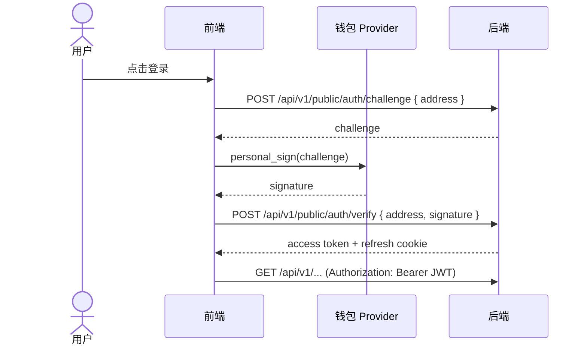
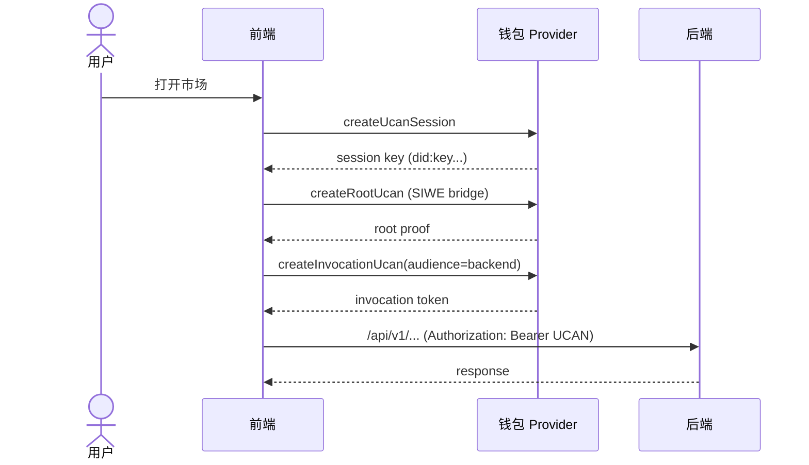
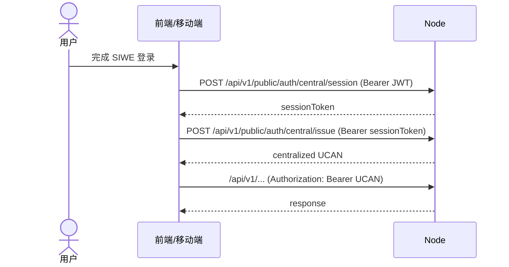
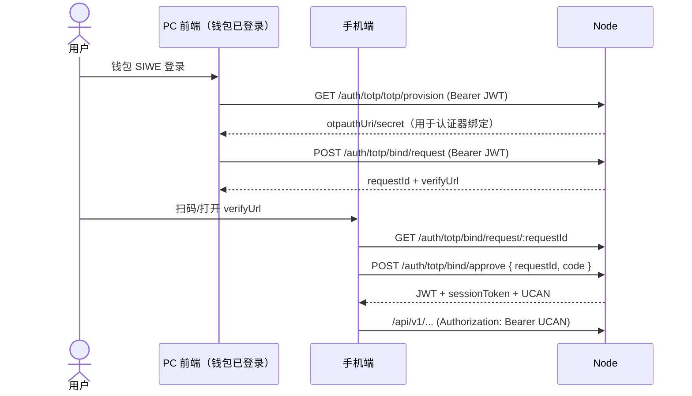
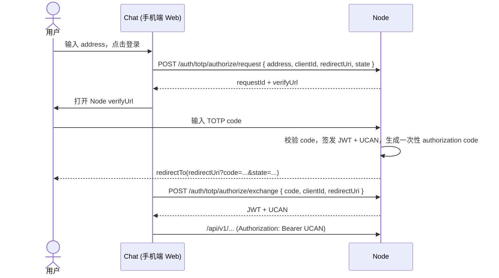

# 登录与授权（长期维护）

本文档是 Node 服务登录与授权的**长期维护主文档**。  
后续涉及 SIWE、JWT、UCAN、权限语义或配置变更时，必须先更新本文档再发布。

## 范围
- 登录协议：SIWE（Challenge/Response）+ JWT
- 授权协议：UCAN（钱包校验模式 + 中心化签发模式）
- 统一入口：`Authorization: Bearer <JWT|UCAN>`
- 适用接口：除 `/api/v1/public/auth/*` 与健康检查外的所有业务接口

## 总体策略
- 校验模式（默认）：UCAN 由前端/钱包生成，服务端只做校验。
- 签发模式（可选）：服务端作为中心化 Issuer，通过 `/api/v1/public/auth/central/*` 提供签发会话与签发接口。
- SIWE 路线负责“用户登录态”（JWT + refresh cookie）。
- UCAN 路线负责“能力授权”（audience + capability + token 有效期）。
- 业务写接口在鉴权后还需要业务签名（`requestId/timestamp/signature`），详见 `权限与签名.md`。

## SIWE (JWT) 流程

对应接口：
- `POST /api/v1/public/auth/challenge`
- `POST /api/v1/public/auth/verify`
- `POST /api/v1/public/auth/refresh`
- `POST /api/v1/public/auth/logout`

## UCAN 校验模式流程（钱包）

## UCAN 签发模式流程（中心化 Issuer）

## 手机登录桥接流程（PC 发起 + TOTP 确认）
适用：手机端没有钱包插件，也未开通短信验证码；希望通过 PC 钱包登录绑定身份后，在手机端完成认证并获取中心化 UCAN。

关键约束：
- 手机端不决定最终身份，`subject` 由 PC 侧 JWT 绑定写入 bind request。
- `bind request` 一次性使用，过期或超出验证码重试次数后失效。
- 验证成功后由 Node 统一签发中心化 UCAN，业务验 token 逻辑不变。

## 手机地址发起授权流程（Chat 推荐）
适用：移动端 Chat 登录页先输入区块链地址，再跳转 Node 完成 TOTP，最后回跳 Chat。

前端页面约定：
- Node 前端提供管理页：`/market/my-config`（需钱包会话，用于配置 `clientId/redirectUri/audience/capabilities`、加载 TOTP 配置并展示二维码、调试 request/approve/exchange）
- Node 前端提供公开页面：`/totp-auth?requestId=...`（无需钱包会话）
- 页面职责：
  - 查询授权请求：`GET /api/v1/public/auth/totp/authorize/request/:requestId`
  - 提交验证码授权：`POST /api/v1/public/auth/totp/authorize/approve`
  - 授权成功后按返回的 `redirectTo` 自动回跳 Chat

关键约束：
- `clientId` 必须使用应用市场 `AppId`（`applications.uid`），且应用已发布（`is_online=true`）。
- `redirectUri` 必须严格命中应用发布字段 `redirectUris`（一对一白名单匹配）。
- `authorize/exchange` 采用一次性短期 `code`，避免把 token 放在 URL。
- `address` 仅作为绑定主体，不可绕过 TOTP 校验直接拿 token。

## UCAN 校验规则（服务端）
服务端要求：
- `aud` 必须等于 `UCAN_AUD`（严格匹配）
- capability 必须满足 `{ with: UCAN_WITH, can: UCAN_CAN }`
- `exp/nbf` 合法
- `prf` 证明链可验证（Root/Delegation）

兼容性：
- 优先 `with/can`
- 兼容历史字段 `resource/action`

资源匹配语义（2026-04 起）：
- 按“**模式交集**”判断资源是否可用
- 允许两种常见情况：
  - token 是通配，服务端要求具体值（如 `app:all:*` 覆盖 `app:all:foo`）
  - 服务端要求是通配，token 是具体值（如 `app:all:localhost-*` 接受 `app:all:localhost-8991`）

动作匹配语义：
- `can='*'` 表示全动作
- 否则按逗号分隔集合判断 required 是否被 available 覆盖（如 `read,write` 覆盖 `read`）

## 接口与权限
- 通用业务接口：支持 `JWT` 或 `UCAN`（Bearer）
- MPC 接口：**必须 UCAN token**（不接受 JWT）
- 中心化签发接口：
  - `GET /api/v1/public/auth/central/issuer`
  - `POST /api/v1/public/auth/central/session`
  - `POST /api/v1/public/auth/central/issue`
  - `POST /api/v1/public/auth/central/revoke`
  - `GET /api/v1/public/auth/totp/status`
  - `GET /api/v1/public/auth/totp/totp/provision`（Bearer JWT/UCAN）
  - `POST /api/v1/public/auth/totp/bind/request`（Bearer JWT/UCAN）
  - `GET /api/v1/public/auth/totp/bind/request/:requestId`
  - `POST /api/v1/public/auth/totp/bind/approve`
  - `POST /api/v1/public/auth/totp/authorize/request`
  - `GET /api/v1/public/auth/totp/authorize/request/:requestId`
  - `POST /api/v1/public/auth/totp/authorize/approve`
  - `POST /api/v1/public/auth/totp/authorize/exchange`

## UCAN 双模式定位
- 校验模式（已实现）：服务端只验证前端/钱包签发的 UCAN（当前默认模式）。
- 签发模式（已实现最小可用）：服务端可作为中心化 Issuer 签发 UCAN，供移动端无钱包插件场景使用。
- 详细设计、运维基线、风险与里程碑见 `UCAN签发模式.md`。

## 配置对齐
服务端：
- `UCAN_AUD`（例如 `did:web:localhost:8100`）
- `UCAN_WITH` / `UCAN_CAN`
- `UCAN_ISSUER_ENABLED` / `UCAN_ISSUER_MODE`
- `UCAN_ISSUER_DID` / `UCAN_ISSUER_PRIVATE_KEY`
- `UCAN_ISSUER_SESSION_TTL_MS`
- `UCAN_ISSUER_TOKEN_TTL_MS`
- `TOTP_AUTH_ENABLED`
- `TOTP_AUTH_TOTP_MASTER_KEY`
- `JWT_SECRET` / `ACCESS_TTL_MS` / `REFRESH_TTL_MS`
- `COOKIE_SAMESITE` / `COOKIE_SECURE`

前端：
- `VITE_UCAN_AUD`
- `VITE_UCAN_WITH` / `VITE_UCAN_CAN`
- `VITE_NODE_API_ENDPOINT`
- Chat 中心化登录建议仅配置：
  - `CENTRAL_UCAN_AUTH_BASE_URL`
  - `CENTRAL_UCAN_APP_ID`（对应 Node 应用市场的 `AppId`）

本仓默认本地配置：
- `ucan.aud = did:web:localhost:8100`
- `ucan.with = app:all:localhost-*`
- `ucan.can = invoke`

## 常见错误与排查
- `UCAN audience mismatch`
  - 含义：token `aud` 与服务端 `UCAN_AUD` 不一致
  - 检查：`VITE_UCAN_AUD` 与服务端 `UCAN_AUD`
- `UCAN capability denied`
  - 含义：token capability 与服务端 required capability 不满足
  - 检查：`VITE_UCAN_WITH/VITE_UCAN_CAN` 与 `UCAN_WITH/UCAN_CAN`
  - 建议：查看后端日志中的 `expectedCap` 与 `tokenCap`
- `UCAN token required`（MPC）
  - 含义：MPC 接口使用了 JWT 或未携带 UCAN
  - 处理：改用 UCAN Bearer token 调用
- `UCAN expired` / `UCAN not active`
  - 含义：token 过期或未生效
  - 处理：前端重发 Invocation；必要时重建 Root + Invocation
- `UCAN issuer mode denied`
  - 含义：当前后端运行在 `verify` 模式，不接受中心化 Issuer 签发 token
  - 处理：切换到 `issue`/`hybrid`，或改用钱包 UCAN
- `Invalid or expired session token`（central）
  - 含义：`/auth/central/issue` 使用了过期或无效 session token
  - 处理：重新调用 `/auth/central/session` 申请新 session token

## 维护约定
- 任一变更满足以下条件时，必须同步更新本文档：
  - 新增/调整 auth 路由
  - 修改 UCAN 校验规则（aud/cap/proof）
  - 修改默认 capability 或匹配语义
  - 修改“接口是否允许 JWT/UCAN”的边界
- 文档更新应包含：
  - 变更日期
  - 变更原因
  - 对前端配置的影响
