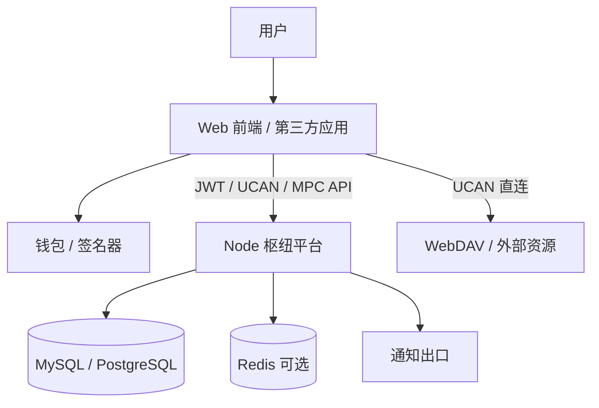
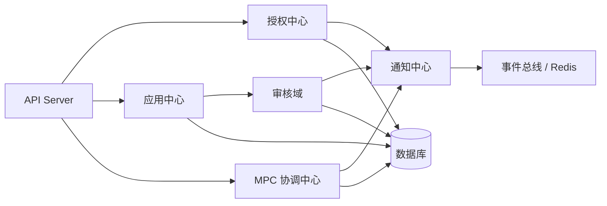

# 系统架构

## 目标定位
Node 不再只是“社区市场后端”，而是社区产品体系里的**枢纽型平台**。当前与目标角色统一按以下四类能力设计：

- **应用中心**：应用发布、版本管理、审核上线、应用配置、应用详情与检索。
- **授权中心**：钱包登录、SIWE/JWT 会话、UCAN 校验、中心化 UCAN 签发、TOTP 二次确认。
- **MPC 钱包协调器**：MPC 会话编排、参与方接入、消息转发、签名请求协调、审计留痕。
- **通知中心**：围绕应用审核、授权确认、MPC 事件、系统状态变更提供统一通知出口。

这四类能力共同构成“入口统一、授权统一、协调统一、通知统一”的平台底座。

## 架构原则

### 1. Node 是平台枢纽，不是单一业务后端
- 对前端应用提供统一接入面。
- 对第三方应用提供统一发布、授权、配置和状态查询能力。
- 对内部能力模块提供统一鉴权、审计和通知编排。

### 2. 登录与授权分层
- **JWT** 负责站内登录态与会话维持。
- **UCAN** 负责跨应用、跨服务、可委托的资源授权。
- Node 既是 UCAN verifier，也是中心化 issuer。

### 3. 核心状态统一落库
- 应用、审核、用户、MPC 会话、TOTP 绑定等核心状态统一由 Node 管理。
- 通知中心后续也应复用同一数据域，避免消息状态散落在各子系统。

### 4. 前端直连资源，Node 负责控制面
- 文件内容、对象存储等数据面尽量由前端直连外部资源。
- Node 主要承载控制面：身份、授权、元数据、审核、协调、通知。

## 逻辑分层

### 接入层
- **Web UI / 第三方应用 / 钱包插件 / 移动端页面**
- 通过 HTTP API、回调地址、SSE、签名流程与 Node 交互。

### 平台服务层
- **应用中心**
  - 应用创建、编辑、发布、下架、依赖配置、版本管理
- **授权中心**
  - SIWE 登录
  - JWT 会话
  - UCAN 校验
  - 中心化 UCAN 签发
  - TOTP 确认
- **MPC 协调中心**
  - 会话管理
  - 参与方加入
  - 消息交换
  - 签名请求协调
  - 审计记录
- **通知中心**
  - 审核结果通知
  - 授权请求通知
  - MPC 状态通知
  - 系统事件通知

### 基础设施层
- **API Server (Express)**：统一 API 承载层
- **鉴权中间件**：JWT / UCAN 统一入口
- **数据库（TypeORM）**：核心状态存储
- **Redis（可选）**：跨实例事件分发与事件流保留
- **WebDAV / 外部服务**：资源数据面

## 当前能力与目标能力

### 已落地
- 应用中心主链路已具备：创建、编辑、上线审核、下架、详情、搜索
- 授权中心主链路已具备：SIWE、JWT、UCAN 校验、中心化 UCAN 签发、TOTP
- MPC 协调器主链路已具备：会话、消息、SSE、签名请求、审计

### 正在演进
- 通知中心仍处于“事件散落在业务流程中”的阶段，尚未形成统一通知域模型。
- 应用中心当前已是主业务入口，后续需要继续吸收通知配置、授权策略配置、接入元数据配置。
- 授权中心后续要继续收敛“钱包插件模式 / 中心化 issuer 模式”的产品体验。

## 高层数据流

### 1. 应用中心流
- 开发者提交应用信息到 Node。
- Node 落库存储应用元数据、审核状态、授权策略。
- 审核通过后，应用进入可发现、可授权、可接入状态。

### 2. 授权中心流
- 用户通过钱包或中心化确认完成登录。
- Node 颁发 JWT 作为站内登录态。
- 当应用需要跨服务访问时，Node 校验或签发 UCAN。

### 3. MPC 协调流
- 客户端创建 MPC 会话。
- 参与方通过 Node 交换消息、协调签名进度。
- Node 记录审计日志，并通过 SSE/事件流广播状态。

### 4. 通知流
- 审核状态变更、授权确认、MPC 关键阶段变更，都会先在 Node 形成统一事件。
- 当前通知能力以接口返回和实时事件为主；后续可继续扩展为站内通知、Webhook、邮件/短信等出口。

## 系统上下文

## 内部模块视图

## 持续演进方向

### 1. 应用中心继续平台化
- 从“应用发布页”演进为“应用接入控制台”
- 收敛应用标识、回调地址、授权策略、依赖关系、环境配置

### 2. 通知中心独立成域
- 建立统一通知事件模型
- 引入通知订阅、已读状态、通知模板与通知出口
- 详细设计持续沉淀在 `docs/通知中心.md`

### 3. MPC 协调器继续强化
- 完善跨实例一致性
- 收敛会话状态机
- 强化签名审计与异常恢复

### 4. 授权中心持续产品化
- 统一钱包模式与中心化 issuer 模式的接入体验
- 继续沉淀 appId、audience、capability 的标准策略模型
