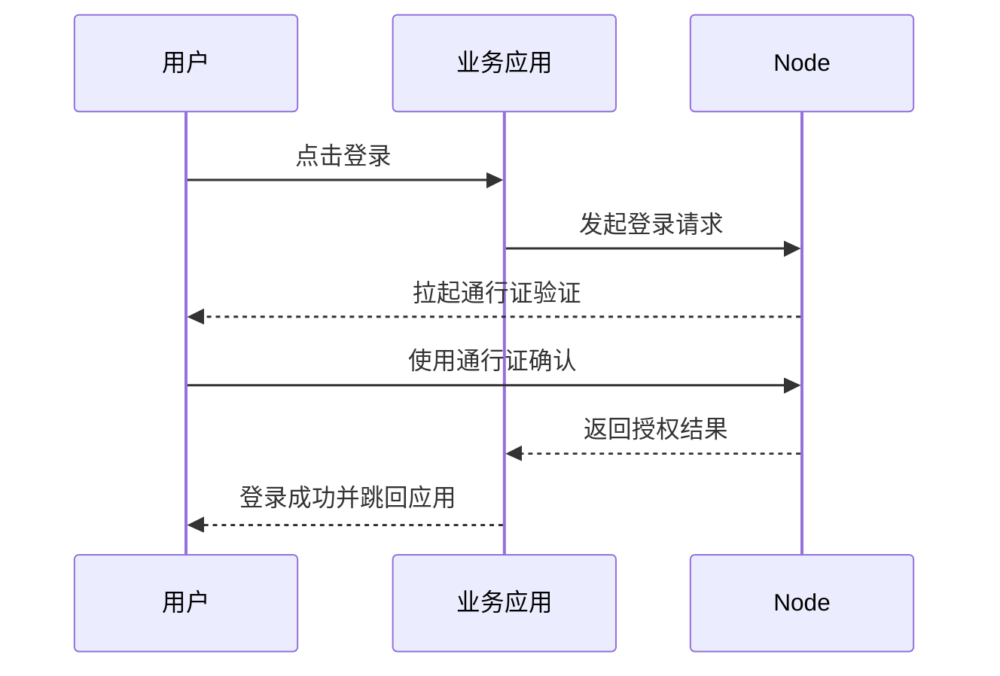

# 使用通行证登录 Web3 应用

## 适合什么场景

当用户没有安装钱包，或者不方便使用钱包时，可以使用通行证完成登录验证。

用户常见体验是：

- 点击登录
- 使用设备上的通行证确认身份
- 登录成功后返回业务应用

## 使用前需要准备什么

### 对应用开发者

- 应用已经发布并上架
- 已配置正确的 `AppId`
- 已配置正确的 `redirectUri`

### 对最终用户

- 浏览器支持通行证
- 用户已经注册过通行证

如果用户还没有注册通行证，需要先到个人中心完成注册。

## 登录流程

## 用户怎么操作

### 1. 点击登录

在支持通行证登录的 Web3 应用中，点击登录按钮。

### 2. 选择通行证验证

系统会拉起设备的通行证验证界面。

你可以使用：

- 指纹
- 面容
- 屏幕锁
- 设备里保存的通行证

### 3. 验证通过后返回应用

验证成功后，页面会自动返回业务应用，完成登录。

## 首次使用通行证怎么办

如果你还没有注册通行证，可以按下面操作：

1. 登录 Node
2. 进入个人中心
3. 打开通行证配置
4. 点击“注册通行证”
5. 按设备提示完成注册

注册完成后，就可以在没有钱包的情况下使用通行证登录。

## 常见问题

### 为什么点击登录后没有弹出通行证验证？

可能原因：

- 当前浏览器不支持通行证
- 站点通行证配置未启用
- 当前用户还没有注册通行证

### 为什么验证成功后没有返回应用？

通常先检查两项：

1. 应用是否已经上架
2. `redirectUri` 是否配置正确

### 通行证和钱包是什么关系？

钱包适合链上签名。  
通行证适合在没有钱包时完成身份验证。

## 继续阅读

- [发布应用](/quickstart)
- [常见问题与排查](/troubleshooting)
