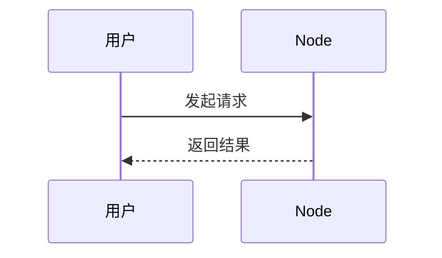

# 图表与图片写法

## 推荐方式

当前帮助页已经原生支持：

- Markdown 图片
- Mermaid 流程图
- Mermaid 时序图

这三种已经够覆盖大部分帮助文档场景。

## 插入图片

```md

```

## Mermaid 流程图

````md

````

效果：


## Mermaid 时序图

````md

````

效果：


## PlantUML 怎么接

如果后面你要统一 UML 风格，建议走两种方式之一：

### 方式一：预先生成图片，再在 Markdown 中引用

```md

```

优点：

- 最稳定
- 不依赖浏览器额外解析

缺点：

- 每次改图都要重新生成

### 方式二：通过 PlantUML / Kroki 服务生成图片

```md

```

优点：

- 可以保留 PlantUML 源码工作流

缺点：

- 依赖外部服务

## 结论

当前项目最适合：

- 说明性文档：Markdown
- 页面内流程图：Mermaid
- 正式 UML 图：PlantUML 导出 SVG 后插图
