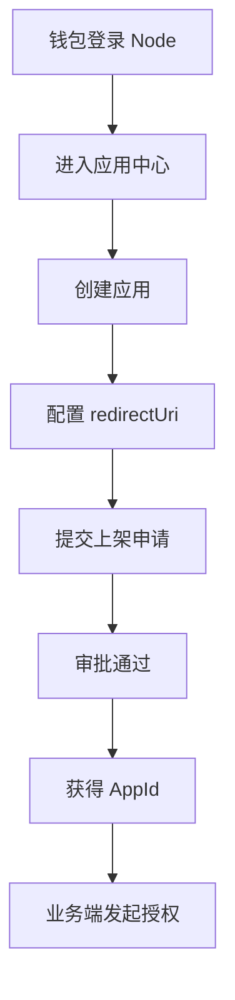

# 发布应用

## 你可以在这里完成什么

- 创建应用
- 提交上架申请
- 获得应用的 `AppId`
- 为后续登录接入准备回调地址

## 操作步骤

### 1. 登录并进入应用中心

使用钱包登录 Node 后，进入“应用中心”。

### 2. 创建应用

在“发布应用”中填写应用信息并保存。

创建完成后，系统会生成这个应用的唯一标识，也就是 `AppId`。

### 3. 配置回调地址

填写应用登录成功后要跳转的地址，也就是 `redirectUri`。

这个地址很重要。后续登录时，系统只允许跳转到这里。

### 4. 提交上架申请

应用信息确认无误后，提交上架申请，等待审批。

### 5. 审批通过后开始接入

应用上架后，你就可以在自己的 Web3 应用中使用这个 `AppId` 发起登录授权。

## 你需要记住的两件事

### `AppId`

`AppId` 就是应用创建后的唯一标识。接入登录时要用它。

### `redirectUri`

`redirectUri` 必须和你在应用中心配置的一致。  
如果不一致，登录完成后不会通过校验。

## 常见问题

### 为什么我创建了应用，却不能立即使用？

因为应用还没有上架。只有审批通过后，应用才可以用于正式登录。

### 回调地址可以随便写吗？

不可以。后续登录时，系统会校验回调地址是否和配置一致。

## 继续阅读

- [使用通行证登录 Web3 应用](/auth)
- [常见问题与排查](/troubleshooting)
